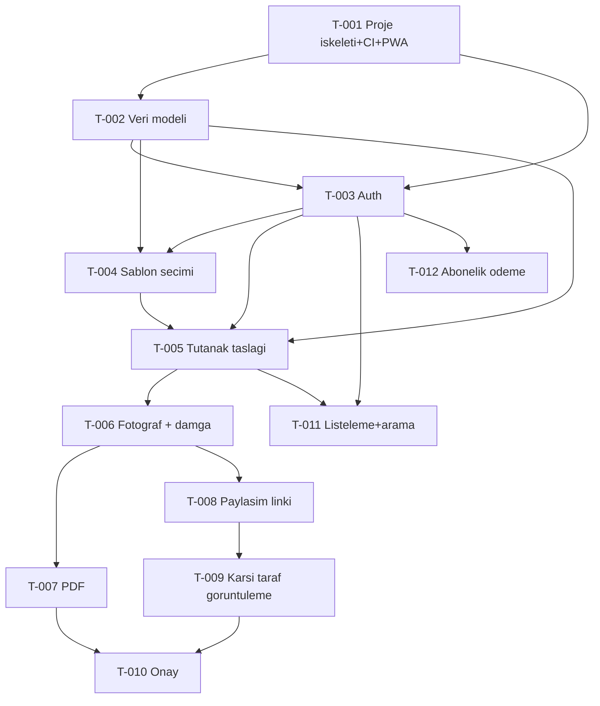

# Backlog — Emlak Teslim Tutanağı Platformu (MVP)

> Uretici: pm-agent (backlog) | Tur: 2 | Kaynak: factory/02-prd/prd.md, factory/03-backlog/REVIEW.md

## 0. Tur 2 Revizyon Notlari (REVIEW.md'ye yanit)
REVIEW.md'de tespit edilen 3 bulgunun tamami bu turda ele alindi:
- **Bulgu 1 (KRITIK, REJECT gerekcesi):** PRD §6 DoD son maddesi ("Uygulama mobil tarayicida kamera erisimiyle calisiyor") hicbir kabul kriterinde somut test edilmiyordu. Duzeltme: T-006'ya, mobil tarayicida cihaz kamerasini dogrudan acan bir giris sunulmasini ve bu davranisin manuel/E2E senaryoyla dogrulanmasini isteyen yeni bir kabul kriteri eklendi.
- **Bulgu 2:** T-011'in T-006'ya bagimliligi gereksizdi (T-011'in kabul kriterleri fotograf/damga verisine ihtiyac duymuyor). Duzeltme: T-011 bagimliligi "T-003, T-005" olarak degistirildi; asagidaki tablo ve mermaid grafigi guncellendi.
- **Bulgu 3:** T-006 kabul kriteri #4, "reddedilir ya da endpoint mevcut degildir" seklinde iki senaryoyu birlestiriyordu. Duzeltme: Tek, net davranis secildi — "guncelleme/PATCH endpoint'i tanimli degildir, damga yalnizca olusturma aninda atanir ve hicbir endpoint uzerinden degistirilemez."

## 1. Genel Bakis

Bu backlog, PRD'deki 11 kapsam-ici madde ile MVP Definition of Done'i, bagimlilik sirasina gore 12 ticket'a boler. Ilk uc ticket (T-001..T-003) altyapi/temel katmandir: proje iskeleti+CI+PWA, veri modeli, kimlik dogrulama. Geri kalan 9 ticket dikey dilimlerdir; her biri kullaniciya dogrudan gorunen bir degeri (form + endpoint + kayit birlikte) teslim eder.

Boyut dagilimi: 3 x S, 9 x M, 0 x L. Hicbir ticket L degildir; L gorulen adaylar (ozellikle "foto+not ile kayit olusturma" ve "onay") daha kucuk, bagimsiz test edilebilir parcalara bolundu (T-005/T-006 ve T-007/T-010).

QA modu: Tek kullanicinin kendi verisiyle test edilebilen ticketlar "izole"; paylasim linki / goruntuleme / onay / odeme gibi iki farkli aktor veya dis servis arasindaki etkilesimi dogrulayan ticketlar "komsulu" olarak isaretlendi (T-008, T-009, T-010, T-012).

## 2. Ticket Listesi (Topolojik Sira)

| Sira | ID | Baslik | Boyut | QA modu | Bagimliliklar |
|---|---|---|---|---|---|
| 1 | T-001 | Proje iskeleti + CI + PWA temel altyapisi | S | izole | yok |
| 2 | T-002 | Veri modeli ve migration'lar | M | izole | T-001 |
| 3 | T-003 | Kullanici kaydi ve girisi (e-posta+sifre) | M | izole | T-001, T-002 |
| 4 | T-004 | Hazir sablon listesi ve secimi | S | izole | T-002, T-003 |
| 5 | T-005 | Tutanak taslagi olusturma (sablon+baslik+not) | M | izole | T-002, T-003, T-004 |
| 6 | T-006 | Tutanaga fotograf ekleme + otomatik tarih-saat damgasi | M | izole | T-005 |
| 7 | T-007 | Tutanak PDF ciktisi olusturma | M | izole | T-006 |
| 8 | T-008 | Tutanagi e-posta/WhatsApp linkiyle paylasma | M | komsulu | T-006 |
| 9 | T-009 | Karsi tarafin hesap acmadan link uzerinden goruntulemesi | S | komsulu | T-008 |
| 10 | T-010 | Tek tikla onay + "destekleyici kanit" uyari metni | M | komsulu | T-007, T-009 |
| 11 | T-011 | Gecmis tutanaklari listeleme ve arama | M | izole | T-003, T-005 |
| 12 | T-012 | Abonelik odeme akisi | M | komsulu | T-003 |
| 13 | T-013 | ~~bcrypt 6.x yukseltmesi~~ **IPTAL** (T-003'e alindi) | S | izole | T-003 |
| 14 | T-014 | /auth/* hiz siniri (429) | S | izole | T-003 |
| 15 | T-015 | Giriste sabit-zamanli dogrulama | S | izole | T-003 |
| 16 | T-016 | SonarCloud quality gate'i yesile cek | S | izole | T-003 |

### 2.1 Tur 3 Eklemeleri (T-003 gelistirmesinde tespit edildi)

Uc ticket backlog'a sonradan eklendi. Ilki bir anayasa celiskisinin cozumu, digerleri
backlog eksigi — ucu de T-003 devlog'unda kayitli:

- **T-013 — IPTAL EDILDI.** Once "bcrypt 5.x → 6.x yukseltmesi" olarak acildi, sonra yanlis
  kurgulandigi anlasildi. `bcrypt` `main`'de yoktur; urune T-003 ile ilk kez girer, yani
  ortada yukseltilecek bir bagimlilik yoktu ve surum secimi T-003'un kendi kapsamidir.
  Ayri ticket kurgusu ayrica cozulemez bir kilit uretiyordu: audit kapisi T-003'u merge
  olmaktan alikoyuyor, ama kapiyi temizleyecek T-013 T-003 merge olmadan baslayamiyordu —
  duzeltme, sorunu getiren ticket'a bagimli dogmustu. Karar T-003'un kabul kriterlerine
  tasindi; CLAUDE.md §6.1 pini `^6.0.0` (gerekce orada). `overrides` ile bastirma ve §9'a
  istisna secenekleri bilincli olarak reddedildi.
  **Ders:** bir CI kapisini duzelten ticket, kapinin arkasindaki ticket'a bagimliysa kurgu
  yanlistir; duzeltme sorunu getiren ticket'in icine aittir.
- **T-014:** API sozlesmesi `/auth/*` icin 429 tanimliyor ve `@nestjs/throttler` §6.1'de
  listeli, ama throttler'i kuran ticket yoktu.
- **T-015:** Giriste kullanici bulunamadiginda bcrypt calistirilmadigi icin olculebilir bir
  zamanlama farki (kullanici numaralandirma) var.

- **T-016:** T-003'un PR'inda (#3) SonarCloud Quality Gate `D Reliability` + `C Security`
  (yeni kod) ile dustu. SonarCloud zorunlu check olmadigi icin T-003 merge edildi; bu ticket
  birikmeyi temizler. Bulgu listesi kimliksiz okunamadigi icin ticket'in ilk isi listeyi
  kaynagindan almaktir.

T-014 ve T-015 "bilinen sinirlama" olarak birakilsaydi release-prep'te security-auditor
bulgusu olarak donup hatti orada durduracakti; ayni is, planliyken ucuz.

## 3. Bagimlilik Grafigi

Not: Grafikte dongu yoktur; T-001 -> T-002 -> T-003 -> ... zinciri her dalda ilerlemeli sekilde tek yonlu akar.

## 4. Kapsama Matrisi

| PRD Kapsam-Ici Madde | Iliskili Hikaye | Gerceklestiren Ticket(lar) |
|---|---|---|
| 1. Fotograf + baslik + not ile kayit olusturma akisi | H-01 | T-005, T-006 |
| 2. Otomatik, degistirilemez tarih/saat damgasi | H-02 | T-006 |
| 3. 3 hazir emlak sablonu | H-03 | T-002 (veri), T-004 (secim) |
| 4. PDF ciktisi olusturma | H-04 | T-007 |
| 5. E-posta / WhatsApp linki ile paylasma | H-05 | T-008 |
| 6. Hesap acmadan link uzerinden tutanak goruntuleme | H-06 | T-009 |
| 7. Tek tikla taraf onayi (zaman damgasi+e-posta, PDF'e islenir) | H-07 | T-010 |
| 8. E-posta + sifre ile kayit/giris | H-08 | T-003 |
| 9. Abonelik odeme akisi | H-09 | T-012 |
| 10. Gecmis tutanaklari listeleme ve arama | H-10 | T-011 |
| 11. Onay ekraninda "destekleyici kanit" uyari metni | H-11 | T-010 |

Altyapi ticketlari (dogrudan bir kapsam maddesine degil, DoD/genel gereksinime baglidir):
| Ticket | Gerekce |
|---|---|
| T-001 | DoD: "Uygulama mobil tarayicida kamera erisimiyle calisiyor (PWA, kurulum gerektirmeden)" — PWA manifest+service worker temelini kurar; kameranin fiili kullanimi ve somut test kriteri T-006'dadir |
| T-002 | Tum madde 1-11'in dayandigi ortak veri modeli/migration altyapisi |

DoD kamera erisimi maddesinin somut kabul kriteri: **T-006** (bkz. Tur 2 revizyon notu, §0).

Kapsam-disi kontrolu: Hicbir ticket, PRD'nin "Kapsam DISINDA (v2+)" listesindeki 11 maddeden (otomatik karsilastirma, e-imza/KEP, SMS/OTP, self-servis sablon, yeni sektor sablonlari, envanter/sigorta modulu, coklu kullanici/rol, native mobil, bildirim/hatirlatma, raporlama/analitik, genis mulk-yonetim modulleri) herhangi birini icermez; her ticket'in "Kapsam DISI" bolumunde ilgili maddelere aciktan atif yapilarak sinir cizildi.

## 5. Acik Sorularla Ilgili Notlar (bilgi amacli, ticket degil)
PRD'nin "Varsayimlar ve Acik Sorular" bolumundeki asagidaki maddeler backlog'a ticket olarak yansitilmadi cunku PRD'de karar netlesmemis; ilgili ticketlarda (T-010, T-012) "Kapsam DISI" olarak isaretlenerek scope creep engellendi:
- Karsi taraf onayi reddederse/yanit vermezse akis (T-010 kapsam disi).
- Coklu taraf onayi ihtiyaci (T-010 kapsam disi).
- Kesin abonelik fiyati (T-012 kapsam disi, placeholder/yapilandirilabilir tutulur).
- Ucretsiz deneme suresi (T-012 kapsam disi).
- Fotograf/kisisel veri saklama-silme politikasi (KVKK) — hicbir ticket'ta ele alinmadi, backlog disi/hukuki inceleme konusu olarak isaretlenir, ileri turda PRD netlesirse yeni ticket acilmali.
