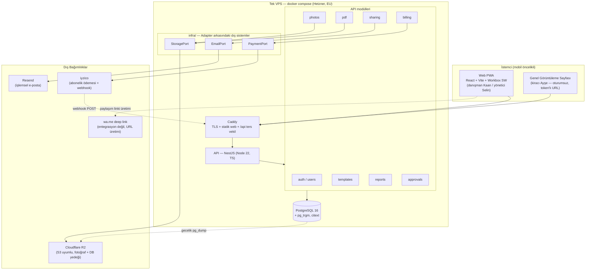

# Mimari — Emlak Teslim Tutanağı Platformu (MVP)

> Üretici: architect-agent | Tarih: 2026-08-12 | Tur: 5
> Kaynak: `factory/02-prd/prd.md`, `factory/03-backlog/backlog.md` (T-001..T-012), `factory/04-architecture/REVIEW.md` (tur 4), `~/.claude/factory-knowledge/`
>
> **Tur 5 değişiklik kaydı (REVIEW.md F-1 + C-1..C-5):** **F-1** (blokleyici) tek bir davranış seçimiyle kapatıldı: `POST /billing/webhook` gövdesi **sağlayıcıya aittir**, bu route'ta `forbidNonWhitelisted` **uygulanmaz**, şemada olmayan alanlar sessizce ayıklanır ve `400` üretmez. Böylece gövde katılığı kuralının **tam olarak iki istisnası** olur (multipart fotoğraf + ödeme webhook'u) ve liste genişletilemez; aynı iki maddelik liste `architecture.md` §7, `CLAUDE.md` §3.7 ve `api-contract.yaml` başlığında birebir yazılıdır. `400` yalnızca zorunlu alanlar eksik/geçersizken döner, tanınmayan referans yine `200`'dür. F-1'in ikinci parçası (alan adı normalizasyonunun katmanı) §8.5'in sonuna bağlayıcı cümle olarak yazıldı: imza doğrulama + normalizasyon `PaymentPort.verifyAndParseNotification(rawBody, signature)` ile **`IyzicoPaymentAdapter`** içindedir, `modules/billing` sağlayıcıya özgü alan adı bilmez, `FakePaymentAdapter` kanonik gövdeyi birebir kabul eder. C-1 `Photo.sizeBytes/widthPx/heightPx` ve `Report.updatedAt` sözleşmede `required` yapıldı; C-2 `CLAUDE.md` §1'e `NestFactory.create(..., { rawBody: true })` yazıldı; C-3 terk edilmiş checkout'ta durumun süresiz `pending` kalacağı ve **zaman aşımı işi olmadığı** §8.4'e eklendi; C-4 `report_photos(report_id, sort_order)` unique kısıtının **bilinçli yokluğu** ve tie-break'in `captured_at` olduğu DDL yorumuna yazıldı; C-5 yazanı/okuyanı olmayan `subscriptions.provider_customer_ref` sütunu **kaldırıldı** (YAGNI). **Kapsam, stack ve merdiven kararları değişmedi.**
>
> **Tur 4 değişiklik kaydı (REVIEW.md E-1, E-2 + C-1..C-6):** **E-1** para hattının yaşam döngüsü tek bağlayıcı kural olarak yazıldı → yeni **§8.5**: `payment_transactions` satırı **checkout'ta** doğar, webhook satırı `provider_reference` ile bulur ve **yalnızca `processed_at IS NULL` iken** koşullu `UPDATE` ile işler; etkilenen satır 0 ise (tekrar veya bilinmeyen referans) hiçbir durum değişmez ve `200` döner. Aynı cümle `CLAUDE.md` §3.13'te birebir, sözleşmede `/billing/webhook` 200 açıklamasında ve `data-model.sql` yorumlarında yankılanır; `CLAUDE.md` §7 desen sözlüğünde idempotans satırı **ikiye ayrıldı** (T-008 = unique kısıt + get-or-create, T-012 = koşullu UPDATE). §7'deki "unique index idempotansı sağlar" cümlesi mekanizmayla düzeltildi. **E-2** multipart fotoğraf yükleme gövdesinde `file` dışındaki alanların **yok sayılacağı** (400 üretmeyeceği) tek davranış olarak seçildi — T-006 kabul kriteri 3 ile uyumlu; §7 girdi doğrulama paragrafı + `CLAUDE.md` §3.7 + sözleşmedeki gövde şeması/açıklaması birebir. C-1 `CheckoutResponse.amount/currency` zorunlu; C-2 DDL'deki seed `INSERT` bloğu "referans" olarak işaretlendi (çalıştırılabilir seed `prisma/seed.ts`); C-3 `subscriptions.provider` DB varsayılanı kaldırıldı, değer `PAYMENT_PROVIDER`'dan yazılır; C-4 `approval` alanı `allOf + nullable` yerine **3.0 uyumlu kalıba** taşındı (onay yoksa alan yanıtta bulunmaz); C-5 `sort_order` atama kuralı yazıldı (§8, sunucuda "mevcut en büyük + 1"); C-6 `PUBLIC_APP_URL` sır listesinden §5.1 yapılandırma tablosuna taşındı. **Kapsam, stack ve merdiven kararları değişmedi.**
>
> **Tur 3 değişiklik kaydı (REVIEW.md D-1..D-5 + C-1..C-5):** D-1 abonelik durum geçişi tek bağlayıcı kural olarak yazıldı → **§8.4** (aynı cümle `CLAUDE.md` §3.12 ve `api-contract.yaml` `Subscription.status` açıklamasında birebir); `checkout` sonrası durum **`pending`**, çelişki giderildi (§8.3 düzeltildi). D-2 `current_period_end`'in kaynağı tanımlandı: `SUBSCRIPTION_PERIOD_DAYS` yapılandırması (varsayılan `30`) + §8.4'te "webhook `succeeded` → `current_period_end = now() + SUBSCRIPTION_PERIOD_DAYS gün`"; `PaymentWebhookRequest` dönem bilgisi taşımaz (sözleşmede açıkça yazılı). `SUBSCRIPTION_PERIOD_DAYS` `CLAUDE.md` §5.1 tablosuna satır olarak yazıldı. D-3 eksik zorunlu yapılandırmalar eklendi: `EMAIL_FROM` ve `PAYMENT_PROVIDER` (`CLAUDE.md` §5.1 + §2.1 tablosu + `.env.example`; `IYZICO_*` sırlarının yalnızca `PAYMENT_PROVIDER=iyzico` iken zorunlu olduğu koşulu `CLAUDE.md` §5'te yazılı). D-4 kanıt bütünlüğü kuralı: `status = 'approved'` iken fotoğraf yükleme **reddedilir** (`409 REPORT_ALREADY_APPROVED`), `shared` iken serbest → §8.1 + `CLAUDE.md` §3.10 + sözleşme. D-5 `POST /reports/{id}/share-link/email` ön koşulu: link **üretmez**, yoksa `404 SHARE_LINK_NOT_FOUND` → §8.1 + `CLAUDE.md` §3.10 + sözleşme. C-1 ölü `whatsapp` enum değeri kaldırıldı (teslim kaydı yalnızca sunucudan yapılan e-posta gönderimi için yazılır); C-2 genel 429 kuralı sözleşme başlığına; C-3 sır listesi tek kaynağa (`CLAUDE.md` §5) indirildi; C-4 `photoCount` zorunlu yapıldı; C-5 fotoğraf sınırlarının ticket'ta değil sözleşmede yaşadığı §5.3'te not edildi. **Kapsam, stack ve merdiven kararları değişmedi.**
>
> **Tur 2 değişiklik kaydı (REVIEW.md B-1..B-6 + C-1..C-5):** B-1 `STORAGE_UNAVAILABLE` hata kodu + 502 yanıtları sözleşmeye eklendi (§2.1); B-2 e-posta hatası tek davranışa indirildi — istisna değil, `202 + status: failed` (§2.1, CLAUDE.md §4.2.2); B-3 `POST /billing/webhook` hız sınırı tanımlandı (§7); B-4 `draft → shared` geçiş kuralı yazıldı (§8, CLAUDE.md §3.10); B-5 `SUBSCRIPTION_PRICE_AMOUNT`/`SUBSCRIPTION_CURRENCY` yapılandırması tanımlandı (§8, CLAUDE.md §5.1); B-6 `details` alanı `EMAIL_ALREADY_REGISTERED`'da da dolu (sözleşme + CLAUDE.md §4.2.3). C-1..C-5 aynı turda alındı (C-5: §10 T-005 satırına "güncelleme/silme endpoint'i yoktur" notu). Ayrıca sözleşme-anayasa kapsam denetimi yapıldı: `ErrorEnvelope.code` enum'undaki **her** kod artık CLAUDE.md §4.2 hiyerarşisinde bir sınıfa bağlıdır (`INVALID_WEBHOOK_SIGNATURE`, `PHOTO_LIMIT_REACHED`, `FILE_TOO_LARGE`, `SUBSCRIPTION_ALREADY_ACTIVE` açıkça yazıldı; `RATE_LIMIT_EXCEEDED`/`INTERNAL_ERROR` framework kaynaklı olarak işaretlendi) ve aynı sınıftan bir boşluk daha kapatıldı: `MeResponse.subscription` zorunlu, `payment_transactions.subscription_id` `NOT NULL` iken abonelik satırının ne zaman doğduğu tanımsızdı → §8.3 (CLAUDE.md §3.10 sonrası §3.11, sözleşmede `/me` açıklaması, DDL yorumu). **Kapsam, stack ve merdiven kararları değişmedi.**

---

## 1. Bir Bakışta Sistem

Tek repo (`repo: main`), tek deploy edilebilir backend + tek statik PWA frontend. Backlog'daki 12 ticket'ın tamamı bu iki uygulama + PostgreSQL + obje depolama + 2 dış SaaS (e-posta, ödeme) ile karşılanır. **Kuyruk yok, cache katmanı yok, arama motoru yok, mikroservis yok** — gerekçeleri §4 (Merdiven Kuralı) bölümünde.

---

## 2. Stack Kararları ve Gerekçeleri

| Katman | Karar | Sürüm |
|---|---|---|
| Dil | TypeScript (strict) | 5.6 |
| Runtime | Node.js LTS | 22.x |
| Backend framework | NestJS | 11.x |
| ORM / migration | Prisma | 6.x |
| Veritabanı | PostgreSQL | 16 |
| Frontend | React + Vite | 19 / 6 |
| PWA | vite-plugin-pwa (Workbox) | 0.21 |
| Sunucu/TLS | Caddy | 2.8 |
| PDF | PDFKit + sharp | 0.15 / 0.33 |
| Obje depolama | Cloudflare R2 (S3 API, `@aws-sdk/client-s3`) | v3 |
| E-posta | Resend | API v1 |
| Ödeme | iyzico (Abonelik/Checkout Form) | API v2 |
| Test | Jest + Supertest + Playwright | 29 / 7 / 1.4x |

**TypeScript tek dil.** Backend ve frontend aynı dilde olduğu için tek dev ajanı tek zihinsel modelle çalışır, DTO tipleri OpenAPI'den üretilerek iki tarafta tekrar yazılmaz; küçük bir MVP'de ikinci bir dil/runtime öğrenme ve CI maliyeti getirir, karşılığı yoktur.

**NestJS.** Ürünün 8 modülü (auth, templates, reports, photos, pdf, sharing, approvals, billing) net katmanlara ayrılmayı gerektiriyor ve dev ajanlarının anayasaya (CLAUDE.md) uyması için framework'ün controller/service/module ayrımını dayatması bir avantaj; Express üzerinde aynı disiplini elle kurmak her ticket'ta yeniden yorum farkı üretir. Nest, DI sayesinde Adapter desenini (StoragePort/EmailPort/PaymentPort) test sahteleriyle değiştirmeyi ek altyapı olmadan mümkün kılar.

**Prisma + PostgreSQL 16.** Backlog T-002 açıkça migration + rollback + seed istiyor; Prisma Migrate bunu tek komutla ve CI'da tekrarlanabilir biçimde verir. PostgreSQL, ilişkisel bütünlük (owner→report→photo→approval zinciri, FK kısıtları T-002 kabul kriteri), `numeric` para tipi, `pg_trgm` ile arama ve JSON esnekliğini tek üründe topladığı için ikinci bir veri deposuna gerek bırakmaz. Bilgi tabanındaki iki ders de (`testing/clock-skew-toleransi.md`, `testing/test-fabrika-yerlesimi.md`) Prisma+Postgres+Jest kombinasyonundan geldiği için önceki üründe kanıtlanmış yol burasıdır.

**React + Vite, ayrı statik SPA (SSR yok).** Ürün oturum arkasındaki bir saha aracı; SEO ihtiyacı yok, tek genel sayfa (kiracı görüntüleme) da indekslenmemesi gereken tokenlı bir URL. Next.js/SSR getireceği sunucu render maliyeti ve deploy karmaşıklığının karşılığı backlog'da yok; Vite build çıktısı Caddy'nin statik olarak servis ettiği dosyalardan ibaret.

**vite-plugin-pwa (Workbox).** T-001 manifest + kayıtlı service worker istiyor; el yazımı SW yerine üretilmiş precache manifesti kullanmak dev ajanının hata yüzeyini düşürür. MVP'de **offline kayıt oluşturma/senkronizasyon yok** (backlog'da yok) — SW yalnızca uygulama kabuğunu precache eder ve kurulabilirliği sağlar.

**PDFKit + sharp (Puppeteer/Chromium DEĞİL).** T-007'nin PDF'i sabit düzenli bir belge (başlık, şablon adı, not, fotoğraflar + damgalar, T-010 ile onay bloğu); bunu programatik çizimle üretmek 4 GB RAM'li tek VPS'te ~40 MB'lik bir kütüphaneyle mümkünken, headless Chromium ~300-400 MB RAM ve ciddi bir güvenlik/bakım yüzeyi getirirdi. `sharp` yüklenen fotoğrafı PDF'e gömülmeden önce yeniden boyutlandırır (uzun kenar 1600 px) — PDF boyutu ve p95 üretim bütçesi (§6) bu sayede tutar.

**Cloudflare R2 (fotoğraf için VPS diski DEĞİL).** Fotoğraf bu ürünün asli kanıt varlığı; dayanıklılığı VPS'in tek diskine bağlamak kabul edilemez bir veri kaybı riski. R2, S3 API'siyle bilinen bir arayüz sunar, çıkış trafiği ücretsizdir (kiracıya link paylaşımı = okuma ağırlıklı yük) ve DB yedeklerini de aynı kovada tutmayı sağlar. Yerelde aynı arayüz MinIO container'ı ile karşılanır, böylece `docker compose up` dış hesap gerektirmez.

**Resend (işlemsel e-posta).** T-008 tek bir e-posta türü gönderiyor (paylaşım linki). Resend'in ücretsiz katmanı (3.000 e-posta/ay) MVP hacmini fazlasıyla karşılar, API'si tek POST'tur. SMTP sunucusu işletmek veya SES'in domain/production-access sürecine girmek MVP için gereksiz sürtünme.

**iyzico (Stripe DEĞİL).** Hedef kitle Türkiye'deki emlak ofisleri, tahsilat ₺ ve yerel kart/taksit ekosistemi üzerinden; Stripe Türkiye'de yerleşik satıcı için standart bir seçenek değil. iyzico'nun Checkout Form + abonelik API'si ve sandbox ortamı T-012'nin "komşulu" QA modunu karşılar.

**WhatsApp: entegrasyon değil, `wa.me` deep link.** T-008 yalnızca "önceden doldurulmuş bir `wa.me` URL'si üretilir" diyor. WhatsApp Business API'si (Meta onayı, şablon mesajı, maliyet) backlog'da karşılığı olmayan bir bileşendir; URL üretimi saf string işlemidir ve dış bağımlılık sayılmaz.

### 2.1 Dış Bağımlılıklar (özet + arıza davranışı + yerel karşılığı)

Sistem dışına çıkan **yalnızca üç** entegrasyon vardır; üçü de `infra/` altında port + adapter arkasındadır (CLAUDE.md §7), bu yüzden testte ve yerelde gerçek hesap gerekmez.

| Bağımlılık | Kullanan ticket | Kritiklik | Arıza davranışı (tanımlı, "sonra bakarız" yok) | Yerel/test karşılığı |
|---|---|---|---|---|
| Cloudflare R2 (obje depolama, S3 API) | T-006, T-007, T-009 | **Kritik** — fotoğraf ürünün kanıt varlığı | Yükleme başarısızsa DB'ye satır **yazılmaz** (önce depolama, sonra kayıt; yetim kayıt oluşmaz), istemciye **`502 STORAGE_UNAVAILABLE`** döner (sözleşmede `POST /reports/{id}/photos` ve `GET /reports/{id}/pdf` altında tanımlı) ve kullanıcı tekrar dener. Okuma başarısızsa PDF üretimi aynı kodla durur, yarım PDF stream edilmez. | MinIO container (`docker compose`), `FakeStorageAdapter` (birim test) |
| Resend (işlemsel e-posta) | T-008 | Orta — paylaşımın tek alternatifi WhatsApp linki | Gönderim senkron denenir; hata **yutulmaz ama istisna da değildir**: `share_deliveries.status = 'failed'` + hata nedeni kaydedilir ve endpoint **`202` + gövdede `status: failed`** döner (T-008 kabul kriteri). `ExternalServiceError` fırlatılmaz, `EMAIL_DELIVERY_FAILED` diye bir hata kodu **yoktur** (tur 1 B-2 çelişkisi bu yönde kapatıldı). Paylaşım linkinin kendisi yine de geçerlidir — kullanıcı `wa.me` ile devam edebilir. Otomatik yeniden deneme **yok** (kuyruk yok, merdiven §4). Zorunlu yapılandırma: `RESEND_API_KEY` (sır) + **`EMAIL_FROM`** (sır değil; gönderen adresi, `CLAUDE.md` §5.1). | Mailpit container, `FakeEmailAdapter` |
| iyzico (ödeme + webhook) | T-012 | Orta — çekirdek tutanak akışını bloke etmez | Checkout çağrısı başarısızsa `502 PAYMENT_PROVIDER_ERROR`, abonelik durumu değişmez. Webhook imzası geçersizse `401`, hiçbir durum değişikliği yapılmaz (`warn` log); imza doğrulama ve sağlayıcı alan adlarının kanonik şekle çevrilmesi adapter'ın tek metodundadır (`verifyAndParseNotification`, §8.5). Sağlayıcı erişilemezken ürünün geri kalanı çalışmaya devam eder (paywall yok — T-012 kapsam dışı). Zorunlu yapılandırma: `IYZICO_*` (sır) + **`PAYMENT_PROVIDER`** (`iyzico` \| `fake`; hangi adapter'ın bağlanacağını belirler, `CLAUDE.md` §5.1). | `FakePaymentAdapter` (`PAYMENT_PROVIDER=fake`), sandbox yalnızca T-012 QA'sında |

`wa.me` bir bağımlılık değildir (sunucu çağrısı yok, saf URL üretimi); DNS/TLS için Let's Encrypt ise Caddy tarafından yönetilen altyapı hizmetidir, uygulama kodunda bağımlılığı yoktur.

---

## 3. Repo ve Çalışma Zamanı Yapısı

Tek repo, npm workspaces ile iki uygulama: `apps/api` (NestJS) ve `apps/web` (React PWA). Paylaşılan `packages/*` **yok** — iki uygulama arasındaki tek sözleşme `factory/04-architecture/api-contract.yaml` olup, web tarafı tiplerini `openapi-typescript` ile bu dosyadan üretir (tek doğruluk kaynağı, elle senkron tutulan ikinci bir tip paketi yok). Tam ağaç ve dosya yerleşim kuralları `CLAUDE.md` §1'dedir.

---

## 4. Merdiven Kuralı Kararları (altyapı bileşenleri)

| Alan | Seçilen basamak | Gerekçe |
|---|---|---|
| **Cache** | **Basamak 0 — cache yok, doğru index** | En sıcak sorgular: kullanıcının kendi tutanak listesi (`owner_id, created_at DESC` bileşik index) ve token ile tekil paylaşım kaydı (unique index). MVP'nin öngörülen tepe yükü (§6) ~10 istek/sn ve tablo hacmi ilk yıl için ~10⁴ satır mertebesinde; bu profilde Postgres index taraması zaten p95 bütçesinin çok altında kalır. Redis'in çözdüğü problem (paylaşımlı state, çok instance) burada **fiilen yok**: tek API instance'ı çalışıyor. |
| **Rate limiting** | **Basamak 1 — uygulama içi bellek (`@nestjs/throttler`)** | Tek instance olduğu için bellek içi sayaç tam doğru sonucu verir; Bucket4j+Redis sınıfı dağıtık limit ancak ikinci bir instance açıldığında anlam kazanır. Terfi tetikleyicisi: API'nin 1'den fazla replikaya çıkması. |
| **Kuyruk / asenkron iş** | **Basamak 0 — senkron** | Backlog'daki tek "yavaş" iş PDF üretimi (T-007) ve tek dış çağrı e-posta gönderimi (T-008). T-007 kabul kriteri isteğin doğrudan `application/pdf` döndürmesini şart koşuyor (senkron zorunlu). T-008 kabul kriteri "gönderim durumu (başarılı/başarısız) yanıtta belirtilir" diyor — bu da senkron çağrıyı zorunlu kılar, kuyruk eklenirse kriter karşılanamaz. Zamanlanmış iş yok (hatırlatma sistemi PRD kapsam dışı madde 9). Dolayısıyla ne scheduler, ne DB-tabanlı kuyruk, ne outbox, ne RabbitMQ, **kesinlikle ne Kafka**. Terfi tetikleyicisi: hatırlatma/otomatik bildirim v2'ye girdiğinde önce Postgres `SKIP LOCKED` tabanlı kuyruk. |
| **Arama** | **Basamak 0/1 — Postgres `ILIKE` + `pg_trgm` GIN index** | T-011 "başlık/not içinde geçen terim" filtresi istiyor; relevans sıralaması, facet, eş anlamlı yok (sıralama kriteri sabit: `created_at DESC`). Ayrıca Postgres'in yerleşik bir **Türkçe** full-text sözlüğü/stemmer'ı yoktur; `to_tsvector('simple', ...)` ile trigram `ILIKE` arasında bu veri hacminde anlamlı bir kalite farkı oluşmaz, trigram ise "kısmi kelime" aramasını (kiracı adının bir parçası) doğal karşılar. Ayrık arama motoru (Meilisearch/Elastic) için backlog'da somut ihtiyaç yok. |
| **Olay akışı / servisler arası mesajlaşma** | **Yok (tek servis)** | Sistem tek deploy birimi; servisler arası olay ihtiyacı fiilen mevcut değil. Tek "dışarıdan gelen olay" iyzico webhook'u — bu da imza doğrulamalı bir HTTP endpoint'i ile karşılanır (§7). |

Bilgi tabanı (`factory-knowledge/backend/`) bu turda **boş**; `testing/` altındaki iki ders alındı ve CLAUDE.md'ye normatif kural olarak işlendi (§9).

---

## 5. Deployment Hedefi

### 5.1 Karar
Repo tipi **tek repo / tek deploy birimi** olduğundan hedef: **tek VPS üzerinde `docker compose`**.

| Bileşen | Hedef | Not |
|---|---|---|
| API (NestJS) | Hetzner Cloud CX22 (2 vCPU / 4 GB / 40 GB NVMe), **Nürnberg (EU)** | Container, `restart: unless-stopped`, tek replika |
| Web (statik PWA build) | Aynı VPS'te Caddy tarafından servis edilir | Ayrı bir CDN/Vercel projesi MVP'de gereksiz ikinci deploy hattı olurdu |
| TLS / reverse proxy | Caddy 2 (otomatik Let's Encrypt) | `app.<domain>` → statik; `app.<domain>/api/*` → API container |
| Veritabanı | **Aynı VPS'te Postgres 16 container'ı**, adlandırılmış volume | Yönetilen DB (Neon/Supabase) MVP maliyetini ~3-4 katına çıkarır; terfi yolu §5.4 |
| Fotoğraflar | Cloudflare R2 kovası (EU) | VPS diskinde tutulmaz |
| DB yedeği | Gecelik `pg_dump | gzip` → R2, 14 gün saklama | Geri yükleme tatbikatı devops runbook'unda |
| CI | GitHub Actions: lint + tsc + test + build (T-001) | Deploy adımı devops-agent'ın işi |

**Veri yeri:** Tüm veri (Postgres + R2 kovası) AB bölgesinde tutulur; müşteri ve kiracı kişisel verisi (ad, adres, fotoğraf) taşıdığı için varsayılan olarak EU bölgesi seçildi. KVKK saklama/silme süresi PRD'de açık soru olarak işaretli — mimari bu soruyu **çözmez**, yalnızca veriyi tek bölgede ve silinebilir (hard delete, §8) tutar.

### 5.2 Maliyet Tahmini (aylık)

| Kalem | Tahmin (USD/ay) |
|---|---|
| Hetzner CX22 | ~5.00 |
| Hetzner otomatik yedek (%20) | ~1.00 |
| Cloudflare R2 (≤20 GB depolama, çıkış ücretsiz) | ~0.40 |
| Resend (ücretsiz katman, 3.000 e-posta/ay) | 0.00 |
| Alan adı (yıllık ~12 USD amortize) | ~1.00 |
| iyzico | Sabit ücret yok; işlem başına komisyon (gelirden düşer) |
| **Toplam** | **~7-8 USD/ay** |

### 5.3 Maliyet Korkuluğu ve Soğuk Başlangıç Kararı
- **Scale-to-zero DEĞİL, sürekli açık tek instance.** Gerekçe doğrudan performans bütçesine bağlıdır (§6): kiracı Ayşe'ye gönderilen link, günün rastgele bir saatinde tek seferlik açılır — bu istek soğuk başlangıca çarparsa 2-5 sn ek gecikme, "genel görüntüleme p95 ≤ 500 ms" bütçesini yerle bir eder ve ürünün onay dönüşüm metriğini (48 saatte %50 onay) doğrudan tehdit eder. Ayrıca sürekli açık VPS (~7 USD), scale-to-zero mimarisinin gerektireceği yönetilen Postgres (en ucuz sürekli katman ~25 USD+) yüzünden zaten daha ucuz: bu üründe scale-to-zero **hem yavaş hem pahalı** olurdu.
- **Otomatik ölçekleme yok.** Yatay ölçekleme kararı bilinçli olarak elle alınır; böylece maliyet tavanı sabit ve öngörülebilirdir.
- Korkuluklar: R2 kovasında 50 GB, VPS diskinde %70 doluluk uyarı eşiği; fotoğraf yükleme başına 10 MB, tutanak başına 30 fotoğraf üst sınırı (API'de zorlanır) — depolama maliyeti kullanıcı davranışıyla patlamasın diye. **Not (kapsam şeffaflığı):** bu iki sınır backlog ticket'larının kabul kriterlerinde **yer almaz**; mimari kaynaklı maliyet/performans korkuluğudur ve bağlayıcı tanımı sözleşmededir (`400 FILE_TOO_LARGE`, `409 PHOTO_LIMIT_REACHED`) — QA bunları ticket'ta değil `api-contract.yaml` üzerinden doğrular, değerler `PHOTO_MAX_BYTES`/`PHOTO_MAX_PER_REPORT` yapılandırmasından gelir.
- Aylık toplam altyapı gideri 25 USD'yi aşarsa bu bir **mimari inceleme tetikleyicisidir**, sessizce ödenmez.

### 5.4 Terfi Yolu (MVP'de UYGULANMAZ, yalnızca tetikleyici kaydı)
İkinci API replikası gerektiğinde: (1) rate limit belleğinden Redis'e taşınır, (2) Postgres yönetilen servise (Neon/Cloud SQL) çıkar. Tetikleyici: sürekli CPU > %60 veya p95 bütçelerinin iki hafta üst üste aşılması. Bu adımlar MVP kapsamında **kodlanmaz**.

---

## 6. Performans Bütçeleri

**Yük varsayımı (MVP gerçekçiliği):** İlk yıl hedefi 20-30 ödeyen emlak ofisi, ofis başına 1-3 kullanıcı. **Tepe eşzamanlı aktif kullanıcı: 30**, tepe istek hızı **~10 istek/sn**, günlük ~150 tutanak, tutanak başına ortalama 8 fotoğraf. Veri hacmi ilk yıl sonunda ~40.000 tutanak satırı, ~300 GB'ın çok altında fotoğraf.

| Akış | Ölçüm noktası | Bütçe |
|---|---|---|
| Kimlik doğrulama (login/register) | Sunucu p95 | ≤ 400 ms (bcrypt cost 10 dahil) |
| Şablon listesi (T-004) | Sunucu p95 | ≤ 150 ms |
| Tutanak taslağı oluşturma (T-005) | Sunucu p95 | ≤ 300 ms |
| Tutanak listesi + arama, 20 kayıt (T-011) | Sunucu p95 | ≤ 350 ms |
| Fotoğraf yükleme, ≤5 MB (T-006) | Sunucu p95 (istek alımı + sharp + R2 PUT) | ≤ 1.500 ms |
| PDF üretimi, ≤10 fotoğraflı tutanak (T-007) | Sunucu p95 | ≤ 3.000 ms |
| Paylaşım linki üretimi (T-008) | Sunucu p95 | ≤ 250 ms |
| Paylaşım e-postası gönderimi (T-008) | Sunucu p95 (Resend çağrısı dahil) | ≤ 2.000 ms |
| Genel görüntüleme — kiracı (T-009) | Sunucu p95 | ≤ 500 ms |
| Onay kaydı (T-010) | Sunucu p95 | ≤ 400 ms |
| Ödeme başlatma (T-012) | Sunucu p95 (iyzico çağrısı dahil) | ≤ 2.500 ms |

**İstemci bütçeleri (mobil, 4G, orta seviye Android):**
| Metrik | Bütçe |
|---|---|
| Uygulama ilk yükleme — LCP (soğuk, SW cache'siz) | ≤ 2,5 sn |
| Tekrar yükleme (SW precache ile) LCP | ≤ 1,2 sn |
| İlk yükte transfer edilen JS (gzip) | ≤ 250 KB |
| Kiracı görüntüleme sayfası LCP (fotoğraflar lazy) | ≤ 2,0 sn |

**Kalite/hata bütçeleri:**
| Metrik | Bütçe |
|---|---|
| 5xx oranı (tüm istekler, 24 sa pencere) | ≤ %0,5 |
| Kimliksiz/geçersiz istekler hariç genel hata oranı | ≤ %1 |
| Aylık erişilebilirlik | ≥ %99,5 (planlı bakım hariç) |
| Veri kaybı hedefi (RPO) | ≤ 24 sa (gecelik yedek); fotoğraflarda 0 (R2 dayanıklılığı) |

Bu tablo perf-agent'ın release ölçütüdür. Bütçeler bilinçli olarak **rahat** tutuldu: daha sıkı hedefler (ör. PDF p95 ≤ 500 ms) MVP'de gereksiz asenkron mimari ve önbellek katmanı davet ederdi.

---

## 7. Güvenlik Tasarımı (varsayılan, "sonra ekleriz" yok)

**Kimlik doğrulama (T-003).** E-posta + şifre; şifre `bcrypt` (cost 10) ile hash'lenir, düz metin asla saklanmaz/loglanmaz. Başarılı girişte HS256 imzalı JWT erişim token'ı yanıt gövdesinde döner (T-003 kabul kriteri bunu şart koşuyor); `exp` 7 gün, iddialar `sub` (user id) + `email`. Refresh token **yok** (MVP'de gereksiz karmaşıklık; süre dolunca yeniden giriş). Token istemcide `localStorage`'da tutulur; XSS riski katı CSP (`script-src 'self'`), React'in varsayılan kaçışı ve `dangerouslySetInnerHTML` yasağı (CLAUDE.md) ile karşılanır. Korumalı her endpoint global `JwtAuthGuard` altındadır; genel endpoint'ler açıkça `@Public()` ile işaretlenir (varsayılan kapalı).

**Yetkilendirme.** Tek rol modeli (PRD kapsam dışı madde 7: rol yönetimi yok). Kural: her tutanak/fotoğraf/PDF/paylaşım işleminde `report.owner_id === currentUser.id` doğrulanır; sahiplik ihlali **403**, var olmayan kayıt **404** döner (T-005, T-007, T-008 kriterleri).

**Yetenek (capability) linkleri (T-008/T-009/T-010).** Paylaşım token'ı 32 bayt kriptografik rastgele (`crypto.randomBytes(32)`, base64url ≈ 43 karakter) — tahmin edilemez. Token'lı sayfalar `X-Robots-Tag: noindex` ve `Referrer-Policy: no-referrer` ile servis edilir. Bu URL'ler yalnızca **okuma + tek onay** yeteneği verir; hiçbir yazma/düzenleme/silme endpoint'i token ile erişilebilir değildir. Token'ın kendisi loglanmaz (URL'ler log'da maskelenir).

**Girdi doğrulama.** Tüm **JSON** istek gövdeleri DTO sınıfları + global `ValidationPipe` (`whitelist: true`, `forbidNonWhitelisted: true`, `transform: true`) ile doğrulanır — beyaz liste dışı alan sessizce yok sayılmaz, 400 döner. Bu kuralın **tam olarak iki istisnası** vardır (aşağıda); liste **genişletilemez**: bu iki route dışında hiçbir endpoint'te "ek alanı yok say" davranışı yoktur. Aynı iki maddelik liste `CLAUDE.md` §3.7'de ve `api-contract.yaml` başlığında birebir tekrarlanır.

> **İstisna 1 (bağlayıcı, T-006 kabul kriteri 3):** `POST /reports/{reportId}/photos` **multipart/form-data** gövdesinde `file` dışındaki **tüm alanlar sunucu tarafından sessizce yok sayılır** — bu endpoint'te `forbidNonWhitelisted` **uygulanmaz** ve ek alan `400` **üretmez**. Gerekçe: T-006 kriter 3 "istemciden gönderilen herhangi bir tarih-saat değeri (varsa) yok sayılır; kaydedilen damga sunucu saatine göre belirlenir" diyor; QA bu kriteri gövdeye `capturedAt` benzeri bir alan koyup **201 + sunucu damgası** bekleyerek doğrular. Yok sayma kuralı hiçbir güvenlik gevşetmesi değildir: dosyanın kendisi boyut + sihirli bayt + `sharp` yeniden kodlama zincirinden geçer, `file` dışındaki alanlar hiçbir kod yolunda okunmaz.
>
> **İstisna 2 (bağlayıcı, T-012 kabul kriteri 2):** `POST /billing/webhook` gövdesi **bize değil ödeme sağlayıcısına aittir**; bu route'ta `forbidNonWhitelisted` **uygulanmaz**, `PaymentWebhookRequest` şemasında olmayan alanlar `whitelist: true` ile **sessizce ayıklanır** ve `400` **üretmez**. Gerekçe: sağlayıcılar bildirim gövdesine rutin olarak ek alan koyar; katı davranışta gerçek bildirim `400 VALIDATION_ERROR` alır, T-012'nin "başarılı sonuç bildiriminde abonelik aktif olur" kriteri üretimde hiç gerçekleşmez ve 4xx yanıtı sağlayıcının bildirimi süresiz tekrarlamasına yol açarak §8.5'teki "imza geçerliyken 4xx dönme" kararının tersini üretirdi. `400` yalnızca **zorunlu** alanlar (`providerReference`, `status`) normalizasyondan sonra eksik/geçersizse döner; **tanınmayan** referans hata değildir (`200`, §8.5). Bu da güvenlik gevşetmesi değildir: gövde **imza doğrulanmadan** hiçbir şekilde işlenmez (aşağıdaki "Webhook güvenliği") ve ayıklanan alanlar hiçbir kod yolunda okunmaz.

Sunucu tarafı damgalar (T-006) istemciden gelen herhangi bir tarih alanını **hiç okumaz**; damga DB'de `DEFAULT now()` ile üretilir ve DB trigger'ı `captured_at` güncellemesini reddeder (savunma katmanı). Dosya yüklemede: boyut ≤ 10 MB, MIME beyanı **değil** sihirli bayt kontrolü (`file-type`) ile `image/jpeg|png|webp` doğrulaması, `sharp` ile yeniden kodlama (EXIF/gömülü yük temizlenir), depolamada rastgele anahtar (kullanıcı dosya adı kullanılmaz).

**Rate limiting** (`@nestjs/throttler`, bellek içi — §4):
| Kapsam | Limit |
|---|---|
| `POST /auth/login`, `/auth/register` | 5 istek / dk / IP |
| `POST /public/reports/{token}/approval` | 5 istek / dk / IP + token |
| `GET /public/reports/{token}` | 60 istek / dk / IP |
| Fotoğraf yükleme | 60 istek / dk / kullanıcı |
| `POST /billing/webhook` (kimliksiz) | **60 istek / dk / IP** — her istekte HMAC doğrulaması yapıldığı için sınırsız bırakmak imza deneme + CPU tüketimi kapısıdır; sağlayıcının normal bildirim hacmi bu sınırın çok altındadır |
| Diğer tüm endpoint'ler (kimlikli: kullanıcı başına, **kimliksiz: IP başına**) | 300 istek / dk |

**Webhook güvenliği (T-012).** iyzico bildirimi imza/HMAC doğrulaması yapılmadan **hiçbir** abonelik durumu değişmez; doğrulama **ham gövde** üzerinde (`main.ts`'te `rawBody: true`) ve gövde ayrıştırmasından **önce** yapılır — bu yüzden yukarıdaki "istisna 2" (şema dışı alanların ayıklanması) imza güvencesini zayıflatmaz. İdempotans iki parçalıdır ve ikisi de zorunludur: `payment_transactions_provider_ref_key` unique index'i referansın **tekilliğini** garanti eder, tekrarlanan bildirimin **iki kez işlenmesini** engelleyen ise koşullu güncellemedeki `processed_at IS NULL` şartıdır (mekanizmanın tamamı §8.5'te bağlayıcı kural olarak yazılıdır — dev bu akışı icat etmez).

**Taşıma ve başlıklar.** Yalnız HTTPS (Caddy otomatik TLS, HSTS), `helmet` ile CSP/`X-Content-Type-Options`/`frame-ancestors 'none'`. CORS: web ve API aynı origin altında servis edildiği için CORS yalnızca yerel geliştirmede (`http://localhost:5173`) açıktır.

**Secrets.** Tümü ortam değişkeni; repoda `.env.example` (yalnız anahtar adları), gerçek `.env` `.gitignore`'da ve VPS'te `chmod 600`. CI sırları GitHub Actions Secrets'ta. **Sırların ve sır olmayan yapılandırmaların TAM listesi `CLAUDE.md` §5 ve §5.1'dedir — tek doğruluk kaynağı orasıdır; bu bölüm listeyi tekrar etmez** (iki liste arasında sapma olmaması için). Sır sızdıran log yasak (CLAUDE.md §4.4 + §5).

**Loglama ve mahremiyet.** Yapısal JSON log (pino); e-posta adresleri log'da maskelenir (`a***@domain`), fotoğraf içeriği ve paylaşım token'ı asla loglanmaz. `approvals.ip_address` / `approvals.user_agent` **kişisel veridir**; yalnızca onay kaydının delil değeri için DB'de tutulur, hiçbir API yanıtında **dönülmez** (`Approval` şemasında tanımlı değildir) ve log'a yazılmaz; saklama süresi PRD'nin KVKK açık sorusuna bağlıdır (netleştiğinde ayrı ticket). Kullanıcı silindiğinde `ON DELETE CASCADE` ile bu satırlar da gider.

---

## 8. Veri Modeli Kararları

Tam DDL: `factory/04-architecture/data-model.sql`.

- **Anahtarlar:** tüm birincil anahtarlar `uuid` + `gen_random_uuid()` (tahmin edilebilir artan ID'lerle kaynak sayımı/erişimi engellenir).
- **Zaman:** tüm zaman alanları `timestamptz`, sunucu tarafında `DEFAULT now()`. Her tabloda `created_at`; mutasyona uğrayan tablolarda ayrıca `updated_at` (trigger ile).
- **Para:** `numeric(12,2)` + `currency char(3)`. **`float`/`double precision` para için yasak.**
- **Index:** her FK sütununda index; ayrıca `reports(owner_id, created_at DESC)` (liste), `reports` üzerinde `pg_trgm` GIN (arama), `share_links(token)` unique, `approvals(report_id)` unique (mükerrer onay DB seviyesinde imkânsız — T-010).
- **Soft delete: KULLANILMIYOR (tek kural).** MVP'de hiçbir silme endpoint'i yok; ileride gerekirse (KVKK silme talebi) **hard delete + `ON DELETE CASCADE`** uygulanır. Hiçbir tabloda `deleted_at` sütunu bulunmaz, hiçbir sorguya "silinmemişleri getir" filtresi eklenmez.
- **Değiştirilemezlik:** `report_photos.captured_at` ve `approvals.approved_at` üzerinde UPDATE'i reddeden trigger vardır (T-006 kabul kriterinin veri katmanı garantisi).
- **Fotoğraf sırası (`report_photos.sort_order`) — bağlayıcı tek kural:** değer **sunucuda yükleme sırasına göre** atanır: aynı tutanaktaki mevcut en büyük `sort_order` + 1 (ilk fotoğraf `0`), ekleme işlemiyle **aynı transaction** içinde hesaplanır. **İstemci `sort_order` gönderemez** (multipart gövdesinde `file` dışındaki alanlar yok sayılır, §7) ve yeniden sıralama endpoint'i **yoktur**. PDF'teki (T-007) ve listelerdeki fotoğraf sırası `(sort_order, captured_at)` ile deterministiktir — `report_photos_report_order_idx` bu sırayı karşılar.
- **Sağlayıcı adı:** `subscriptions.provider` sütununa yazılan değer **DB varsayılanından değil**, `PAYMENT_PROVIDER` yapılandırmasından (`CLAUDE.md` §5.1) gelir; yerelde/testte `fake`, üretimde `iyzico`. Böylece sahte adapter'la doğan satırlar gerçek sağlayıcı adıyla etiketlenmez.
- **Enum'lar:** `report_status`, `subscription_status`, `payment_status`, `share_channel`, `delivery_status` Postgres ENUM tipleridir (yazım hatası kaynaklı geçersiz durum imkânsız).

### 8.1 Tutanak durum geçişi (bağlayıcı tek kural)

`POST /reports/{id}/share-link` **başarılı olduğunda** `reports.status` `draft` → `shared`'a geçer (kayıt zaten `shared`/`approved` ise durum korunur, hata dönmez); `shared` → `approved` geçişi **yalnızca onay kaydıyla** (`POST /public/reports/{shareToken}/approval`) olur; **geri geçiş yoktur** ve durumu doğrudan değiştiren bir endpoint tanımlı değildir. E-posta gönderimi (`POST /reports/{id}/share-link/email`) durumu **değiştirmez** — durumu belirleyen olay linkin var olmasıdır, iletim kanalı değil. Geçiş, ilgili kaydı yazan aynı transaction içinde yapılır. Aynı cümle `api-contract.yaml` (`ReportStatus` + share-link endpoint açıklaması) ve `CLAUDE.md` §3.10'da birebir tekrarlanır; T-008 ve T-010 dev ajanları bu tek kaynağa bakar.

**İçerik değiştirilebilirliği (kanıt bütünlüğü — bağlayıcı tek kural).** `reports.status = 'approved'` iken `POST /reports/{id}/photos` **reddedilir** (`409 REPORT_ALREADY_APPROVED`); `draft` ve `shared` durumlarında yükleme serbesttir. Gerekçe: PDF her istekte yeniden üretildiği için (T-007 senkron üretim) onaydan sonra eklenen bir fotoğraf onay damgasının altında yeni içerik olarak görünür ve onayın kanıt değeri çöker — bu yüzden onay, tutanağın içeriğini **dondurur**. Tutanağın kendisinde güncelleme/silme endpoint'i hiç yoktur (§10, T-005), dolayısıyla dondurulan yüzey yalnızca fotoğraf eklemedir. Aynı cümle `CLAUDE.md` §3.10 ve sözleşmedeki `POST /reports/{reportId}/photos` açıklamasında birebir tekrarlanır.

**Paylaşım e-postasının ön koşulu (bağlayıcı tek kural).** `POST /reports/{id}/share-link/email` paylaşım linki **üretmez**; ilgili tutanak için link yoksa `404 SHARE_LINK_NOT_FOUND` döner — önce `POST /reports/{reportId}/share-link` çağrılır. Böylece "linkin varlığı durumu belirler" değişmezi korunur: e-posta endpoint'i hiçbir koşulda `draft` bir tutanak için geçerli genel link ortaya çıkarmaz.

### 8.2 Abonelik tutarının kaynağı (T-012)

`payment_transactions.amount` `NOT NULL CHECK (amount > 0)` olduğu için ödeme başlatıldığı anda bir tutar gerekir. Bu tutar **koda gömülmez**: `SUBSCRIPTION_PRICE_AMOUNT` (ondalıklı **string**, ör. `199.00`) ve `SUBSCRIPTION_CURRENCY` (varsayılan `TRY`) yapılandırma anahtarlarından gelir; değer `numeric(12,2)` sütunlarına ve `CheckoutResponse.amount`'a birebir string olarak yazılır, **float'a parse edilmez**. Her iki anahtar `config/` zod şemasında ve `.env.example`'da tanımlıdır (tam liste: `CLAUDE.md` §5.1). Gerekçe: PRD kesin fiyatı açık soru olarak bırakmış, T-012 ise "yapılandırılabilir tutulur" diyor — fiyat değişikliği kod değişikliği değil, ortam değişkeni değişikliğidir.

### 8.3 Abonelik satırının yaşam döngüsü (bağlayıcı tek kural)

`MeResponse.subscription` sözleşmede **zorunlu** bir nesnedir, `payment_transactions.subscription_id` ise `NOT NULL` FK'dir; bu ikisi "satır ne zaman doğar" sorusunu tek cevaba zorlar. Kural: **kayıt (T-003) sırasında `subscriptions` satırı YAZILMAZ.** Satır yalnızca `POST /billing/checkout` çağrısında, `subscriptions_user_id_key` unique kısıtına dayanan **get-or-create** ile oluşturulur (CLAUDE.md §7 idempotans deseni; satır DB varsayılanı `status = 'inactive'` ile doğar, `currency = SUBSCRIPTION_CURRENCY`, `price_amount` ödeme başlatılırken yazılır ve **aynı transaction içinde durum `pending`'e taşınır** — §8.4). Satır yokken `GET /me` **satır yaratmaz**: `{ status: 'inactive', priceAmount: null, currency: SUBSCRIPTION_CURRENCY, currentPeriodEnd: null }` varsayılan nesnesini döner. Böylece T-003 dev ajanı billing modülünü hiç bilmez, T-012 dev ajanı da tek noktadan sorumludur.

### 8.4 Abonelik durum geçişi (bağlayıcı tek kural)

`subscriptions.status` kullanıcıya `GET /me` ile **görünen** bir alandır (`MeResponse.subscription.status`) ve T-012'nin iki kabul kriteri doğrudan bu değere bakar; bu yüzden geçişler tek kaynakta, aşağıdaki cümleyle sabitlenir. Aynı cümle `CLAUDE.md` §3.12 (satırın yaşam döngüsü §3.11'dedir) ve `api-contract.yaml` → `Subscription.status` açıklamasında birebir tekrarlanır:

> `POST /billing/checkout` başarılı olduğunda `subscriptions.status` (`inactive` ya da yeni oluşturulmuş satır) → **`pending`**; webhook `succeeded` → **`active`** ve `current_period_end = now() + SUBSCRIPTION_PERIOD_DAYS gün` yazılır; webhook `failed` → **`inactive`** ve `current_period_end` `NULL` bırakılır; durum **`active`** iken gelen `failed` bildirimi durumu **düşürmez** (aktif dönem sonuna kadar korunur). Geçiş, `payment_transactions` satırını yazan (checkout) ya da güncelleyen (webhook) aynı transaction içinde yapılır; **hangi satırın ne zaman yazıldığı/güncellendiği §8.5'te bağlayıcı olarak tanımlıdır** ve webhook geçişi yalnızca koşullu güncelleme 1 satır etkilediğinde uygulanır.

Bunun iki somut sonucu vardır ve dev ajanı bunları icat etmez:
- **`pending` görünürlüğü:** ödeme başlatıldıktan sonra sonuç bildirimi gelene kadar kullanıcı `pending` görür; web tarafı üç değeri de (`inactive`, `pending`, `active`) render eder ve `pending`'i "ödeme sonucu bekleniyor — abonelik henüz aktif değil" olarak gösterir (T-012 kriteri: "aktife geçmez ve bu açıkça belirtilir").
- **`current_period_end`'in kaynağı:** `subscriptions_active_needs_period` CHECK'i `active` durumda bu alanın dolu olmasını zorunlu kılar. Değer **koda gömülmez** ve sağlayıcı bildiriminden **okunmaz**: `PaymentWebhookRequest` bilinçli olarak dönem bilgisi taşımaz (sözleşmede böyle not edilmiştir), değer sunucuda `SUBSCRIPTION_PERIOD_DAYS` yapılandırmasından (varsayılan `30`, `CLAUDE.md` §5.1) hesaplanır. Gerekçe: MVP'de tek bir aylık plan vardır; dönem uzunluğunu sağlayıcı gövdesine bağlamak, sözleşmeye doğrulanması gereken ve şu an kullanılmayan bir alan eklerdi.

- **Terk edilmiş ödeme (bağlayıcı):** kullanıcı checkout başlatıp sağlayıcı sayfasını terk eder ve hiçbir bildirim gelmezse `subscriptions.status` **süresiz `pending`** kalır, `payment_transactions` satırı `initiated` + `processed_at NULL` kalır ve `GET /me` bu `pending` değerini döndürmeye devam eder (T-012 kriter 4'ün beklenen çıktısı budur). MVP'de zaman aşımı/temizlik işi **yoktur** — zamanlayıcı, cron veya "X dakika sonra iptal et" mantığı **yazılmaz** (§4 merdiven kararı: asenkron/zamanlanmış iş yok). Kullanıcı yeniden `POST /billing/checkout` çağırabilir; get-or-create aynı abonelik satırını kullanır ve yeni bir referansla yeni bir ödeme satırı doğar.

Abonelik durumu **hiçbir yerde erişimi kısıtlamaz** (paywall T-012 kapsam dışı); yalnızca görüntülenen bir bilgidir.

### 8.5 Ödeme kaydının yaşam döngüsü ve webhook idempotansı (bağlayıcı tek kural)

§8.4 durumun **ne olacağını** söyler; bu bölüm durumu değiştiren satırın **nasıl** yazıldığını söyler. Aşağıdaki cümle bağlayıcıdır ve `CLAUDE.md` §3.13'te birebir tekrarlanır:

> `POST /billing/checkout`, sağlayıcıdan işlem referansını aldıktan sonra `payment_transactions` satırını **yazar**: `status = 'initiated'`, `provider_reference = <sağlayıcı işlem referansı>`, `amount = SUBSCRIPTION_PRICE_AMOUNT`, `currency = SUBSCRIPTION_CURRENCY`, `processed_at = NULL`. `POST /billing/webhook` **yeni satır yazmaz**; satırı `provider_reference` ile bulur ve **yalnızca `processed_at IS NULL` iken** tek bir koşullu güncellemeyle işler: `UPDATE payment_transactions SET status = <succeeded|failed>, failure_reason = …, processed_at = now() WHERE provider_reference = $1 AND processed_at IS NULL`. **Etkilenen satır sayısı 1 ise** aynı transaction içinde §8.4'teki abonelik geçişi uygulanır. **Etkilenen satır sayısı 0 ise** (bildirim daha önce işlenmiş **veya** referans hiç tanınmıyor) **hiçbir abonelik/ödeme alanı değişmez**, `current_period_end` yeniden hesaplanmaz ve endpoint yine `200` döner (`warn` log).

Bunun dört somut sonucu vardır ve dev ajanı bunları icat etmez:

- **İdempotansın gerçek mekanizması `processed_at` koşuludur.** `payment_transactions_provider_ref_key` unique index'i yalnızca referansın **tekilliğini** garanti eder (aynı referansla ikinci bir satır doğamaz); tekrarlanan `succeeded` bildiriminin dönemi ikinci kez uzatmasını engelleyen şey **koşullu UPDATE**'tir. Bu yüzden T-012, `CLAUDE.md` §7'deki "unique kısıt + get-or-create" desenine **tabi değildir** (o desen T-008 paylaşım linki içindir); sözlükte T-012 için ayrı satır vardır.
- **Bilinmeyen referans hata değildir.** Sağlayıcı, bizim başlatmadığımız veya kaydı silinmiş bir işlem için bildirim gönderirse yanıt `400` değil `200`'dür: imza geçerliyken 4xx dönmek sağlayıcının bildirimi süresiz tekrarlamasına yol açar. Durum değişmediği için güvenlik etkisi yoktur; olay `warn` seviyesinde loglanır (`providerReference` log'a yazılabilir, sır değildir).
- **`amount` her zaman doludur.** Satır checkout'ta doğduğu için `payment_transactions_amount_positive` CHECK'i hiçbir zaman bildirim anında değerlendirilmez; webhook tutar yazmaz, tutarı **doğrulamaz** da (MVP'de tek plan var).
- **`subscription_id` bildirim anında türetilmez.** FK, satır doğarken checkout içindeki abonelikten (get-or-create sonucu, §8.3) yazılır; webhook güncellediği satırdan `subscription_id`'yi **okur**.

Sağlayıcı çağrısı başarısız olursa (`502 PAYMENT_PROVIDER_ERROR`) referans oluşmadığı için `payment_transactions` satırı da **yazılmaz** ve abonelik `pending`'e taşınmaz — durum değişmeden kalır (§2.1 arıza davranışı).

**Gövde normalizasyonunun katmanı (bağlayıcı tek cümle).** `PaymentWebhookRequest` şemasındaki alan adları (`providerReference`, `status`, `failureReason`) **bizim kanonik adlarımızdır**; gerçek sağlayıcı gövdesindeki adlar bu şekle **`IyzicoPaymentAdapter` içinde** çevrilir. İmza doğrulaması + normalizasyon tek bir port metodundadır: `PaymentPort.verifyAndParseNotification(rawBody, signature)` (ham gövde erişimi için `main.ts`'te `rawBody: true` — `CLAUDE.md` §1). Controller yalnızca ham gövde + imza başlığını port'a iletir; `modules/billing` sağlayıcıya özgü hiçbir alan adı bilmez. `FakePaymentAdapter` (yerel + T-012 QA) kanonik gövdeyi birebir kabul eder — böylece dev ajanı ile QA aynı gövdeyi bekler.

---

## 9. Bilgi Tabanı Derslerinin Uygulanması

| Ders | Uygulama |
|---|---|
| `testing/clock-skew-toleransi.md` | CLAUDE.md §8'e normatif kural: DB üretimi timestamp'ler host saatiyle karşılaştırılırken **iki taraflı**, adlandırılmış `CLOCK_SKEW_TOLERANCE_MS` penceresi kullanılır. T-006/T-010 damga testleri bu üründe doğrudan bu desene tabidir. |
| `testing/test-fabrika-yerlesimi.md` | CLAUDE.md §1 ağacında `apps/api/test/factories/` ayrı klasör olarak tanımlandı; `test/db.ts` yalnızca bağlantı/SQL altyapısı barındırır. İlk test altyapısını kuran ticket T-002 olduğu için kural oraya kadar geçerli hale getirildi. |
| `backend/` | Bu turda ders yok — çelişki kaydı da yok. |

---

## 10. Ticket → Bileşen Eşlemesi

| Ticket | Dokunacağı bileşen(ler) |
|---|---|
| T-001 Proje iskeleti + CI + PWA | Repo kökü (npm workspaces), `apps/api` iskelet (NestJS main/app.module, `GET /health` — `/api/v1` öneki dışında, kimliksiz, `{"status":"ok"}`; altyapı endpoint'i olduğu için `api-contract.yaml`'ın kapsamı dışındadır, sözleşme başlığında böyle not edilmiştir), `apps/web` iskelet (Vite+React, `vite-plugin-pwa` manifest+SW), `docker-compose.yml` (api, db, minio, mailpit), `.github/workflows/ci.yml`, ESLint/Prettier/tsconfig, README |
| T-002 Veri modeli ve migration'lar | `apps/api/prisma/schema.prisma` + migrations + `seed.ts` (3 şablon), `data-model.sql` ile birebir uyum, `apps/api/test/db.ts` + `test/factories/*`, CI'a migrate adımı |
| T-003 Kayıt/giriş | `modules/auth` (controller, service, DTO, `JwtStrategy`, `JwtAuthGuard`, `@Public()`), `modules/users` (repository/servis), `common/filters` hata zarfı, throttler auth limitleri, `apps/web` login/register sayfaları + `api/client.ts` token taşıma |
| T-004 Şablon listesi/seçimi | `modules/templates` (controller+service, salt okuma), `templates` tablosu, `apps/web` şablon seçim ekranı |
| T-005 Tutanak taslağı | `modules/reports` (controller, service, DTO, mapper, sahiplik kontrolü), `reports` tablosu, `apps/web` tutanak oluşturma formu. **Not:** tutanak **güncelleme/silme endpoint'i tanımlı değildir** (sözleşmede yalnızca `POST /reports` + `GET /reports/{id}` vardır) — kriter 5'in "düzenleme denemesi 403" kısmı `GET /reports/{reportId}` üzerinden doğrulanır; dev ajanı PATCH/PUT/DELETE **icat etmez** |
| T-006 Fotoğraf + damga | `modules/photos` (controller, service, `sharp` işleme, sihirli bayt doğrulama, **onaylı tutanakta yükleme reddi → 409**, §8.1; **kriter 3'ün doğrulama yolu:** multipart gövdesine eklenen `capturedAt` benzeri alanlar **yok sayılır → 201 + sunucu damgası**, 400 dönmez — §7 girdi doğrulama istisnası; `sort_order` sunucuda "mevcut en büyük + 1" ile atanır, §8), `infra/storage` (`StoragePort` + `R2StorageAdapter` + `FakeStorageAdapter`), `report_photos` tablosu + immutability trigger, `apps/web` kamera girişli yükleme bileşeni |
| T-007 PDF | `modules/pdf` (`ReportPdfService`, PDFKit düzeni, `sharp` küçültme), `modules/reports` (PDF endpoint'i, sahiplik + "fotoğrafsız → 400" kuralı), `infra/storage` (fotoğraf okuma) |
| T-008 Paylaşım linki + e-posta/WhatsApp | `modules/sharing` (controller, `ShareLinkService` idempotent token, `WhatsAppLinkBuilder` saf fonksiyon, **e-posta endpoint'i link üretmez → linksizse 404**, §8.1), `infra/email` (`EmailPort` + `ResendEmailAdapter` + `FakeEmailAdapter`), `share_links` + `share_deliveries` tabloları, `apps/web` paylaşım ekranı |
| T-009 Oturumsuz görüntüleme | `modules/sharing` genel controller (`@Public()`, token çözümleme), salt-okunur görünüm DTO'su, presigned fotoğraf URL'leri, `apps/web` `/t/:token` genel sayfası (uygulama kabuğundan bağımsız, oturum gerektirmez) |
| T-010 Onay + uyarı metni | `modules/approvals` (genel POST endpoint'i, tekil onay kuralı → 409), `approvals` tablosu + unique index, `modules/pdf` onay bloğu eklentisi, `reports.status` → `approved`, `apps/web` genel sayfada uyarı metni + tek tık onay bileşeni |
| T-011 Listeleme + arama | `modules/reports` (list endpoint'i, `q` parametresi, sayfalama, `created_at DESC`), `pg_trgm` GIN index, `apps/web` liste + arama ekranı |
| T-012 Abonelik ödemesi | `modules/billing` (checkout endpoint'i, `@Public()` imzalı webhook endpoint'i — **gövde katılığı istisnası 2: şema dışı alanlar ayıklanır, 400 dönmez**, §7; **imza doğrulama + sağlayıcı alan adı normalizasyonu adapter'da**, §8.5, **ödeme satırı yaşam döngüsü + `processed_at IS NULL` koşullu güncellemesiyle idempotans §8.5**, **durum geçişi + `current_period_end` hesabı §8.4**), `infra/payment` (`PaymentPort` + `IyzicoPaymentAdapter` + `FakePaymentAdapter`), `subscriptions` + `payment_transactions` tabloları, `modules/users` `GET /me` abonelik durumu, `apps/web` abonelik ekranı |

**Boşluk kontrolü:** 12 ticket'ın 12'si en az bir bileşene eşlendi; eşlenemeyen ticket yok. Ters yönde: mimaride hiçbir bileşen yok ki bir ticket'a hizmet etmesin (kuyruk, cache, arama motoru, ikinci servis, rol/izin motoru, bildirim zamanlayıcısı bilinçli olarak **yok**).
