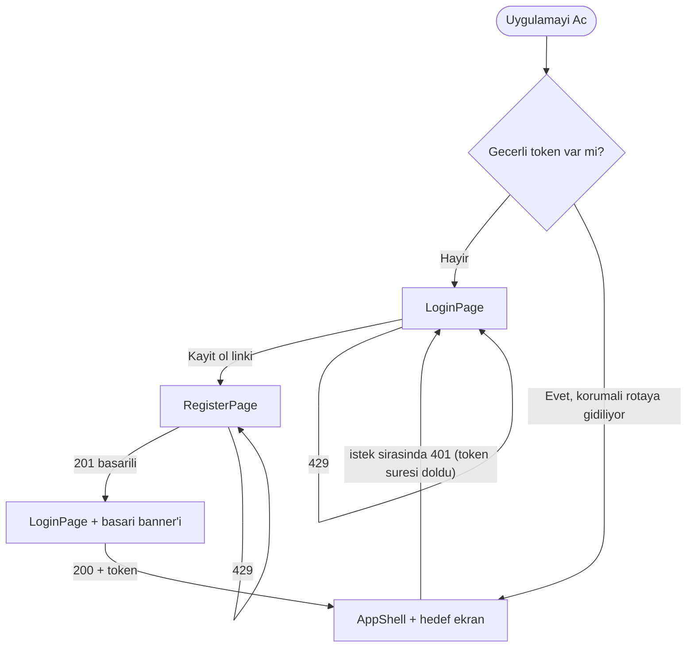
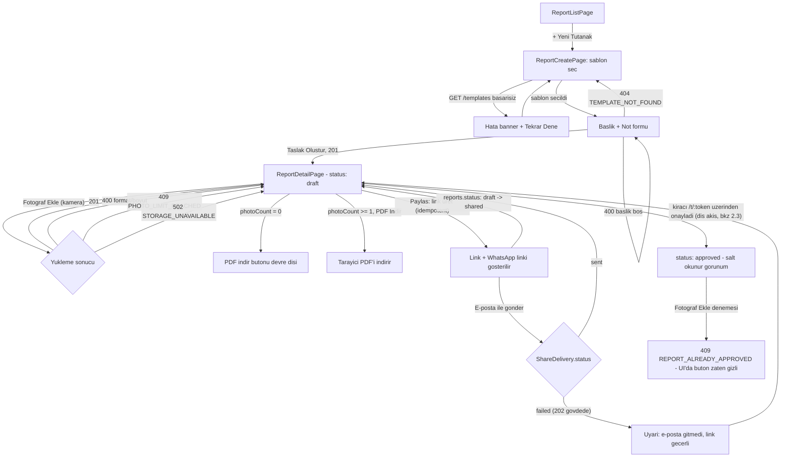
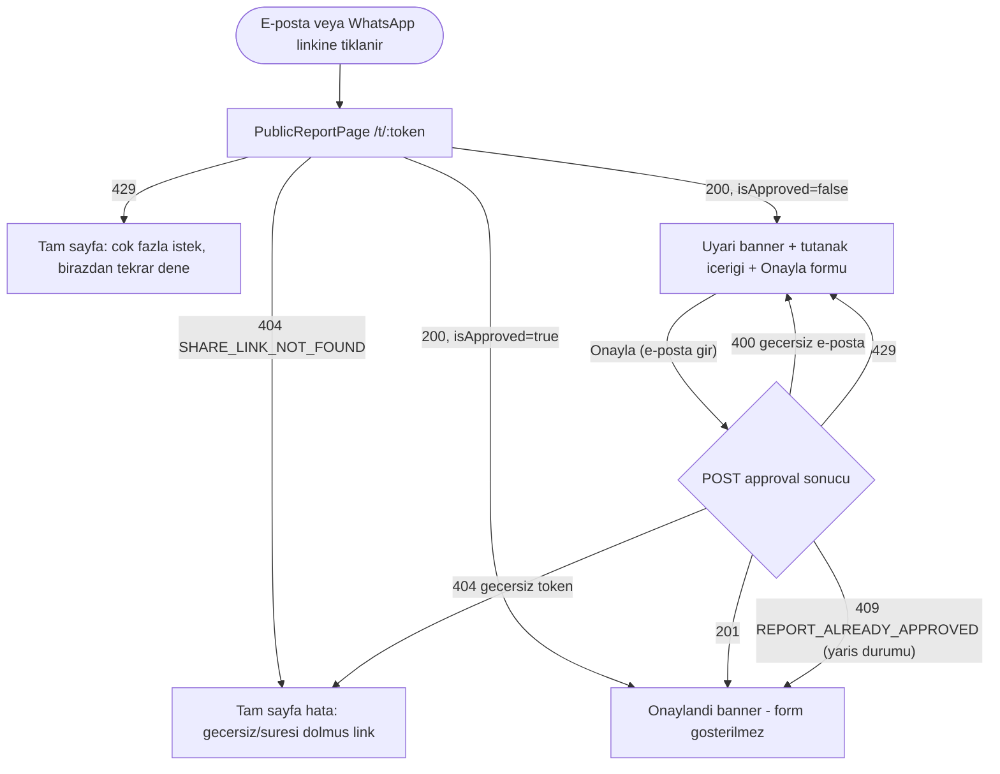
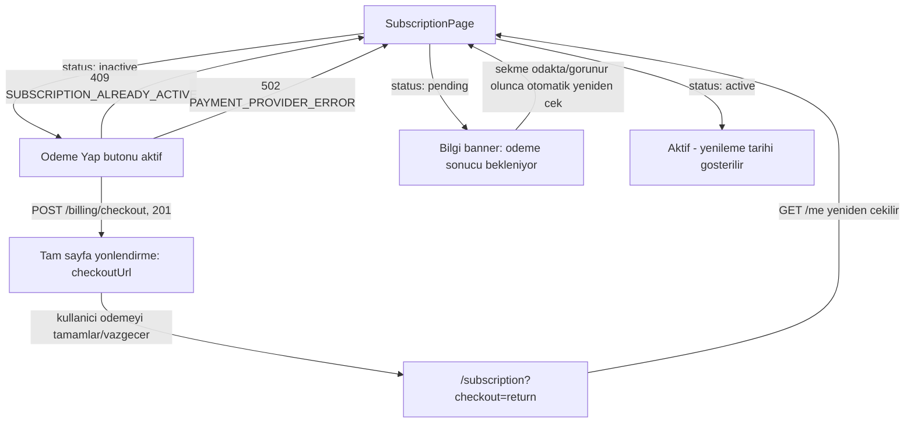

# Tasarim Dokumani — Emlak Teslim Tutanagi Platformu (MVP)

> Uretici: ux-designer-agent | Tarih: 2026-08-12
> Kaynak: `factory/02-prd/prd.md`, `factory/03-backlog/backlog.md`, `factory/04-architecture/api-contract.yaml`,
> `factory/04-architecture/architecture.md`, `factory/04-architecture/CLAUDE.md`,
> `factory/05-dev/T-001-devlog.md`, `factory/05-dev/T-002-devlog.md`, `apps/web/src/**` (fiili kod).
>
> **Baglayicilik notu:** Bu belge ile `design-tokens.json` celisirse **token dosyasi kazanir**. Token'da
> beyan edilmeyen bir renk/metin kombinasyonu urunde denetlenmez — denetlenmemesi guvenli oldugu
> anlamina gelmez, dev-agent yeni bir kombinasyon eklerse once tokene `pairs` girdisi eklenmelidir.

## 0. Baslangic Durumu — Mevcut Koddan Sapma Yok

T-001 ve T-002 yalnizca altyapi kurdu (PWA kabugu, CI, veri modeli); `apps/web/src` icinde henuz
**hicbir ekran/sayfa bileseni yok** — `main.tsx` sabit bir placeholder (`<h1>Emlak Teslim Tutanagi</h1>`)
render ediyor ve router/sayfalar T-003+ icin birakilmis (T-001 devlog, "Bilinen Sinirlamalar"). Bu yuzden
bu tasarim mevcut bir UI ile celismiyor; tek somut miras **marka rengi**dir:

- `index.html` → `<meta name="theme-color" content="#0f2a4a">`
- `public/manifest.webmanifest` → `background_color`/`theme_color`: `#0f2a4a`

Bu koyu lacivert deger, asagidaki token setinde **`primary` olarak birebir korunur** (bkz. §4, §5) —
degistirilmedi, ikinci bir marka rengi icat edilmedi. `apps/web/package.json` icinde hicbir UI kit
(MUI/Ant/Tailwind) veya CSS-in-JS kutuphanesi yuklu degil; bu, `CLAUDE.md` §6.2'nin bilincli karariyla
("Bir UI kit'in tamamı — ağır kit bundle bütçesini yer") tutarlidir. Bu belge de o karari sapmadan
izler: bilesenler **duz CSS degiskenleri (custom properties) + CSS Modules veya esdegeri** ile
uygulanacak sekilde tanimlanmistir, yeni bir stil kutuphanesi onerilmez.

---

## Estetik Yon

> Bu bolum, rol tanimindaki 6 estetik karari mevcut sisteme (renkler/tipografi/bilesenler — hepsi
> §4'teki tokenlarla birebir ayni) uygular; yeni renk/font/deger onermez, `design-tokens.json`'a
> dokunulmaz. Genel tasarim sistemi baglaminda (§4 ile birlikte okunur), ekran sartnamelerinden (§3)
> once yer alir.

### Karakter cumlesi
"Bu urun, bir emlak teslim anini sonradan tartisilamaz hale getiren resmi bir evrak uretir — arayuz bu
evrakin guvenilirligini, sakinligini ve degistirilemezligini yansitmali; hicbir yerde eglenceli, gecici
veya 'taslak hissi veren' bir ton tasimamalidir." Bu cumle §0'daki tek somut mirasla (koyu lacivert
`primary`, kurumsal/bankacilik cagirisimi yapan bir ton) dogrudan hizalanir: lacivert zaten "resmiyet"
tasiyor, bu bolum onu bilincli bir urun karakterine baglar — icat edilmis yeni bir yon degil, mevcut
mirasin adlandirilmasidir.

### Tipografi
`system-ui` (token `body_family`/`heading_family`, §4.2) varsayilana kacis degil, PWA'nin offline-first
dogasindan gelen gerekceli bir karar: ozel bir web fontu indirmek hem ilk yuklemede (Kaan sahada, zayif
mobil veri ile calisir — PRD §2 "Kullanim ani") hem tekrar ziyarette sifir ek bant genisligi/render-
engelleme riski anlamina gelir; bu, `architecture.md` §6'daki bundle butcesi (≤250KB gz) disipliniyle
ayni mantigin tipografiye yansimasidir. Karakter, font secimiyle degil agirlik/boyut sicramalariyla
tasinir: 1.25 oranli olcek (§4.2) H2 (~31px, ekran/kart ana basliklari) ile Govde (16px) arasinda
belirgin bir "resmi baslik" hiyerarsisi kurar (ör. `ReportDetailPage`'de tutanak basligi H2, sablon
adi/not Govde, §3) — sistem fontunun kendi agirlik varyantlariyla (regular/semibold) desteklenir, ekstra
font-weight dosyasi indirilmez.

### Renk hikayesi
- `primary` (#0f2a4a): sahnede yalnizca "resmiyet ve eylem" anlarinda gorunur — AppShell header/nav,
  birincil butonlar, secili sablon kenarligi (`TemplateCard`), "paylasildi" durum rozeti. Sayfa govdesine
  yayilmaz (govde her zaman `surface`/`surface-muted`, §4.1) — resmi bir muhur gibi her yerde degil,
  dogru yerde kullanilir.
- Zinc notrleri (`surface-muted` #f4f4f5, `text-muted` #52525b, `border` #71717a): bilincli bir secim,
  "gelecek revizyon adayi" degil — zinc'in soguk alt tonu, `primary` lacivertin de soguk olmasiyla uyum
  saglar; sicak bir gri (warm gray/stone) lacivertle catisip urune iki farkli sicaklikta karakter
  kazandirirdi. Notrler yalniz "zemin/ikincil bilgi" isini gorur, hicbir zaman anlam tasimaz — bir durum
  gostermek gerektiginde her zaman `success`/`warning`/`danger`/`primary` kullanilir (§4.1 "renk anlami
  kurali"); `draft`/`inactive` rozetlerinin notr olmasi da bilinclidir ("henuz eylem alinmadi" anlaminda
  notr, gorsel bosluk degil).
- `success`/`warning`/`danger`: yalnizca durum/sonuc bildirir, hicbir zaman dekoratif kullanilmaz — bu,
  "resmi evrak" karakteriyle dogrudan orer: renk gorsel suslemeden once bir *is/hukuki durum sinyali*dir.

### Imza ogesi
`StatusChip` (durum rozeti sistemi) secildi — draft/shared/approved (tutanak) ve inactive/pending/active
(abonelik) durum dili bu urunun kalbidir, cunku bir tutanagin "durumu" onun hukuki/is gecerliligini
dogrudan temsil eder (`approved` bir tutanak salt-okunurdur ve degistirilemez; `draft` degildir, §2.2).
Bu tek rozet dili urun genelinde tekrarlanir: `ReportListPage` (`ReportCard` icinde), `ReportDetailPage`
(baslik yaninda) ve `SubscriptionPage` (`SubscriptionStatusCard` icinde, §3) — ayni sekil dili (`pill`
radius + anlam rengi/zemin eslemesi, §4.1/§4.4) uc farkli veri turunde ayni "durum" kavramini gorsel
olarak birbirine baglar; kullanici bir kez "rozet = durum" okumasini ogrendiginde her ekranda ayni
sekilde okur. `PublicReportPage` `StatusChip` kullanmaz — kimliksiz sayfa kendi `SuccessBanner`/
`DisclaimerBanner` diline sahiptir (§3); bu bilincli bir istisnadir, farkli bir izleyiciye (kiraci,
hesapsiz) hitap ettigi icin imza ogesinin tutarliligini bozmaz.

### Hareket taban cizgisi
Bu urun icin ilk kez burada standartlanir (dokumanin geri kalaninda tanimli degildi):
- **Sure:** 120-150ms, **easing:** standart `ease-out` (CSS `cubic-bezier(0, 0, 0.2, 1)` esdegeri) —
  kisa ve tutucu, resmi evrak urunune uygun; yayli/bouncy/elastic easing kullanilmaz.
- **Nerede kullanilir:** `Toast` giris/cikis, `Banner` acilma/kapanma, `SharePanel` alt-panel acilis/
  kapanisi — hepsi *gecici, geri alinabilir* UI durumlari.
- **Nerede KULLANILMAZ:** `StatusChip` durum degisimleri (draft→shared, pending→active gibi) her zaman
  **animasyonsuz, anlik** gerceklesir — bu, §3 `ReportCreatePage`'de `TemplateCard` secimi icin zaten
  tanimli kuralin ("check ikonu + kenarlik animasyonsuz anlik degisim") urun geneline genisletilmis
  halidir: bir is/hukuki durum degisikligini "yumusak gecis" ile gostermek, degisikligin kesinligini
  belirsizlestirir izlenimi verir. Sayfa/rota gecisleri de animasyonsuzdur — PWA'da hiz, sahada Kaan
  icin gecikme hissinden daha degerlidir.
- *Gelecek revizyon adayi:* Bu sure/easing degerleri `design-tokens.json`da henuz bir `motion` anahtari
  olarak tokenlestirilmedi (golge kurallari gibi, §4.4, bilinçli olarak prose-only kaldi) — dev-agent'lar
  bu degerleri simdilik dogrudan CSS'e sabit yazar; ileride bir motion token seti eklenmesi tutarliligi
  makine-dogrulanabilir kilar.

### Kacinilacaklar
- **Emoji/renkli ikon:** §0/§3'te LoginPage basligi zaten "metin, ikon yok" olarak tanimli ve §4.5 ikon
  kutuphanesi "secilmedi, tek renkli inline SVG (`currentColor`)" — bu urunde emoji veya renkli ikon,
  "resmi evrak" karakter cumlesiyle dogrudan celisir (bir tutanak PDF'inde emoji olmaz, arayuzde de
  olmamali).
- **Gradyan/doku uzerinde `primary`:** Lacivert her zaman duz zemin olarak kullanilir; gradyan veya doku,
  evrak kesinligi yerine "pazarlama/promosyon" hissi verir.
- **Sicak/canli ek aksan renkleri:** `success`/`warning`/`danger`/`primary` disinda hicbir aksan rengi
  (ör. mor, turkuaz vurgu) eklenmez — token setinde yok, icat edilmez; her yeni renk bir anlam ihlali
  riski tasir (§4.1 renk anlami kurali).
- **Oynak/eglenceli mikro-kopi tonlama:** Hata/bos durum metinleri (§3) duz, bilgilendirici, resmi
  Turkce kullanir ("Henuz tutanaginiz yok" gibi) — unlem, espri veya bosluk-doldurucu ifade kullanilmaz.
- **Yayli/elastic animasyon:** Yukaridaki hareket taban cizgisiyle dogrudan celisir, kullanilmaz.

### Platform notu (web-react PWA)
Hover ve focus esdegerdir ama esit ONCELIKTE degildir: urun mobil-oncelikli sahada kullanilir (Kaan,
PRD §2) ve dokunmatik cihazlarda hover hic tetiklenmez — bu yuzden hover yalnizca **masaustu (Selin)
deneyimini iyilestiren** bir katman olarak ele alinir, hicbir eylem yalnizca hover ile ulasilabilir
olmaz; klavye/dokunmatik-disi odak (`:focus-visible`) zaten §5'te tanimli, tam esdeger gezinme yolu
olarak zorunludur.

---

## 1. Ekran Envanteri

`CLAUDE.md` §1'deki `apps/web/src/pages/` listesiyle birebir hizalidir — yeni sayfa icat edilmedi,
listede olan hicbir sayfa atlanmadi.

| Ekran | Amac | Hizmet ettigi hikayeler | Tukettigi endpoint'ler |
|---|---|---|---|
| **LoginPage** (`/login`) | E-posta+sifre ile giris | H-08 | `POST /auth/login` |
| **RegisterPage** (`/register`) | Yeni hesap olusturma | H-08 | `POST /auth/register` |
| **ReportListPage** (`/reports`) | Kendi tutanaklarini listeleme, arama, yeni tutanak baslatma girisi | H-10 | `GET /reports` (q, page, pageSize), `GET /me` (AppShell kullanici bilgisi) |
| **ReportCreatePage** (`/reports/new`) | Sablon secimi + baslik/not ile taslak olusturma | H-01 (baslangic), H-03 | `GET /templates`, `GET /templates/{id}`, `POST /reports` |
| **ReportDetailPage** (`/reports/:id`) | Fotograf ekleme+damga goruntuleme, PDF indirme, paylasim linki/e-posta/WhatsApp, onay durumunu izleme | H-01 (fotograf), H-02, H-04, H-05 | `GET /reports/{id}`, `POST /reports/{id}/photos`, `GET /reports/{id}/photos`, `GET /reports/{id}/pdf`, `POST /reports/{id}/share-link`, `GET /reports/{id}/share-link`, `POST /reports/{id}/share-link/email` |
| **SubscriptionPage** (`/subscription`) | Abonelik durumu goruntuleme, odeme baslatma | H-09 | `GET /me`, `POST /billing/checkout` |
| **PublicReportPage** (`/t/:token`) | Kiracinin oturumsuz goruntuleme + tek tikla onay + "destekleyici kanit" uyarisi | H-06, H-07, H-11 | `GET /public/reports/{token}`, `POST /public/reports/{token}/approval` |

**Sahiplik kontrolu:** 11 kapsam-ici PRD maddesinin tamami ve 12 ticket'in tamami en az bir ekrana
baglanir; PRD'de karsiligi olmayan ekran eklenmedi (ozellikle: rol/yetki ekrani, sablon editoru,
karsilastirma ekrani, bildirim ayarlari, analitik panel — hepsi kapsam disi, `CLAUDE.md` §11).

**Ekran disi ortak yapi — AppShell (bagimsiz route degil):** LoginPage/RegisterPage/PublicReportPage
disindaki 4 ekran (ReportList/ReportCreate/ReportDetail/Subscription) ortak bir kimlik dogrulamali
kabuk icinde render edilir: ust bar (uygulama adi + kullanici e-postasi + cikis) ve gezinme
(Tutanaklarim / Yeni Tutanak / Abonelik). Bu bir sayfa degil, `router.tsx` icinde paylasilan bir
duzen bilesenidir (§4'te bilesen olarak tanimli).

---

## 2. Akis Diyagramlari

### 2.1 Kimlik dogrulama

### 2.2 Tutanak olusturma + yonetme (Kaan/Selin — kimlikli)

### 2.3 Oturumsuz goruntuleme + onay (Ayse — kiraci)

### 2.4 Abonelik odemesi (Selin)

---

## 3. Ekran Sartnameleri

### LoginPage
- **Bolgeler:** Ust: uygulama adi/logo (metin, ikon yok). Orta: form (e-posta, sifre). Alt: birincil
  "Giris Yap" butonu, ardindan "Hesabiniz yok mu? Kayit olun" linki (`/register`).
- **Bilesenler:** `Input` (email, password + goster/gizle toggle), `Button` (primary, tam genislik),
  `InlineFieldError`, `Banner` (info — RegisterPage'den yonlendirilince basari mesaji icin).
- **Durumlar:**
  - *loading:* buton spinner gosterir + disabled; tum inputlar disabled.
  - *empty:* yok (form her zaman iki alanla baslar).
  - *error:* 400 → alan bazli hata (`details[]`); 401 `INVALID_CREDENTIALS` → **form-genel** banner
    "E-posta veya sifre hatali" (hangi alanin yanlis oldugu belirtilmez — guvenlik); 429 → banner
    "Cok fazla deneme yaptiniz, birazdan tekrar deneyin".
  - *success:* token saklanir, korumali hedef rotaya (varsa `redirectTo`, yoksa `/reports`) gecilir.
- **Mobil notu:** Tek kolon, tam genislik input'lar; klavye acikken "Giris Yap" butonu viewport
  disina cikmamali (sabit alt bar veya scroll-into-view); sifre goster/gizle ikonu 44×44px dokunma
  alaninda.

### RegisterPage
- **Bolgeler:** LoginPage ile ayni iskelet; form (e-posta, sifre, sifre tekrar — **sifre tekrar
  yalnizca istemci tarafi dogrulamadir**, API'ye gonderilmez, `RegisterRequest` yalnizca
  `email`+`password` alir).
- **Bilesenler:** `Input` × 3, kalici yardimci metin "En az 8 karakter" (yalnizca hatada degil,
  surekli gorunur), `Button` (primary), `InlineFieldError`.
- **Durumlar:**
  - *loading:* buton spinner, form disabled.
  - *error:* 400 → alan bazli; 409 `EMAIL_ALREADY_REGISTERED` → `details[0].field === 'email'`
    dogrudan e-posta alaninin altina baglanir ("bu e-posta zaten kayitli"); istemci tarafi sifre
    eslesmeme hatasi da ayni InlineFieldError deseniyle gosterilir; 429 → banner.
  - *success:* `/login`'e yonlendirilir + basari banner'i ("Hesabiniz olusturuldu, giris yapin") —
    **otomatik giris yapilmaz**, cunku `POST /auth/register` token donmez (yalnizca `User`).
- **Mobil notu:** Sifre kurallari onceden gorunur oldugu icin kullanici hatali gonderim yapip
  geri donmek zorunda kalmaz (kucuk ekranda scroll maliyeti yuksek).

### ReportListPage
- **Bolgeler:** AppShell altinda; ust: arama kutusu (sticky); orta: tutanak kart listesi; alt/kose:
  "+ Yeni Tutanak" (mobilde sag-alt FAB, genis ekranda ust-sag buton); liste altinda sayfalama.
- **Bilesenler:** `SearchInput` (debounce ~400ms, `q` parametresi), `ReportCard` (title, templateName,
  `StatusChip`, photoCount, createdAt — goreli/okunur tarih bicimi), `Button` (FAB, primary),
  `Pagination`, `EmptyState`, `Skeleton` (kart iskeleti).
- **Durumlar:**
  - *loading:* 3-5 iskelet kart.
  - *empty (hic tutanak yok, `q` bos):* `EmptyState` — "Henuz tutanaginiz yok" + CTA "Ilk tutanagini
    olustur" → `/reports/new`.
  - *empty (arama sonucu yok):* `EmptyState` — "'{q}' icin sonuc bulunamadi" + "Aramayi temizle".
  - *error:* 401 → LoginPage'e yonlendir (AppShell seviyesinde global); diger hatalarda banner
    "Tutanaklar yuklenemedi" + "Tekrar Dene" butonu.
  - *success:* liste + `total`/`page`/`pageSize`'a gore sayfalama kontrolleri.
- **Mobil notu:** FAB sag-alt sabit (safe-area-inset ile), kartlar tek kolon; `md` (768px) uzerinde
  2 kolonlu kart izgarasina gecebilir (zorunlu degil, kademeli iyilestirme).

### ReportCreatePage
- **Bolgeler:** 2 adimli akis (tek sayfada, `StepIndicator` ile): (1) sablon secimi — 3 `TemplateCard`
  dikey liste; (2) secilen sablon ustte sabitken baslik + not formu, altta "Taslak Olustur" birincil
  buton.
- **Bilesenler:** `TemplateCard` (secilebilir; secili durumda `primary` renginde 2px kenarlik +
  `surface-muted` arka plan), `Input` (title, zorunlu, maxLength 200), `Textarea` (note, opsiyonel,
  maxLength 5000 + karakter sayaci), `Button` (primary, sablon+baslik doluymadan disabled),
  `StepIndicator` (1/2).
- **Durumlar:**
  - *loading:* `GET /templates` yuklenirken 3 iskelet kart.
  - *empty:* teorik olarak olmaz (sozlesme "tam olarak 3 kayit" garanti eder) — yine de bos donerse
    genel hata banner'i gosterilir (savunmaci).
  - *error:* sablon listesi yuklenemedi → banner + "Tekrar Dene"; gonderimde 400 (baslik bos) → alan
    hatasi; 404 `TEMPLATE_NOT_FOUND` → banner "Secilen sablon artik gecerli degil, sayfayi yenileyin"
    + sablon listesi yeniden cekilir.
  - *success:* `POST /reports` 201 → `ReportDetailPage`'e (`/reports/:id`) yonlendirilir.
- **Mobil notu:** 3 sablon karti **dikey** listelenir (yatay kaydirma degil — 3 oge icin dikey daha
  guvenilir dokunma saglar), her karti min 44px yukseklikte buyuk dokunma alani; secim aninda haptik
  benzeri gorsel geri bildirim (check ikonu + kenarlik animasyonsuz anlik degisim).

### ReportDetailPage
- **Bolgeler:** Ust: baslik + sablon adi + `StatusChip` (draft/shared/approved); not metni; fotograf
  izgarasi; "Fotograf Ekle" (gizli dosya input, `capture="environment"`); alt/sabit aksiyon bari:
  "PDF Indir" + "Paylas" (paylasim bolumu acilir panel: link kutusu + kopyala + WhatsApp butonu +
  e-posta gonderim formu).
- **Bilesenler:** `StatusChip`, `PhotoGrid` + `PhotoThumbnail` (koseye damga overlay'i — bkz. §5
  kontrast notu), `CameraInput` (gizli `<input type="file" accept="image/*" capture="environment">`),
  `Button` ("PDF Indir" — `photoCount === 0` iken disabled + yardimci metin "PDF olusturmak icin en
  az 1 fotograf ekleyin"), `SharePanel` (`ShareLinkBox` + `Button` WhatsApp + `Input`+`Button`
  e-posta), `Toast` (yukleme/paylasim bildirimleri), `SuccessBanner` (onaylandi durumu).
- **Durumlar:**
  - *loading:* baslik + galeri iskeleti.
  - *empty (photoCount = 0):* galeri yerine `EmptyState` "Henuz fotograf eklenmedi" + kamera CTA;
    "PDF Indir" disabled (yukarida).
  - *error (fotograf yukleme):* 400 `UNSUPPORTED_MEDIA_FORMAT`/`FILE_TOO_LARGE` → toast ("Desteklenmeyen
    dosya turu" / "Dosya cok buyuk, en fazla 10 MB"); 409 `PHOTO_LIMIT_REACHED` → toast + 30. fotografta
    "Fotograf Ekle" butonu proaktif olarak disabled edilir; 409 `REPORT_ALREADY_APPROVED` → UI bu durumu
    zaten `status === 'approved'` iken butonu **gostermeyerek** onler (backend'in 409'u savunma
    katmanidir, kullanici UI'da hic karsilasmamalidir); 502 `STORAGE_UNAVAILABLE` → toast "Yukleme
    basarisiz, tekrar deneyin" + tekrar dene.
  - *error (PDF):* 400 `REPORT_HAS_NO_PHOTOS` zaten disabled ile onlenir; 502 → toast "PDF
    olusturulamadi, tekrar deneyin".
  - *error (paylasim linki uretimi):* genel hata banner'i, "Tekrar Dene".
  - *bilgi (e-posta gonderimi basarisiz — hata degil):* `202` + `ShareDelivery.status === 'failed'`
    → **danger degil `warning`** tonunda inline mesaj: "E-postayi gonderemedik ({errorMessage}).
    Link her zaman gecerli — WhatsApp veya kopyalama ile paylasabilirsiniz." (link'in kendisi
    gecerliligini korur, bu kullanicinin akisini durdurmamali).
  - *is kurali (UI sirasi — sozlesme geregi):* `SharePanel`, e-posta gondermeden **once** her zaman
    `POST /reports/{id}/share-link`'i (idempotent) cagirir; boylece `404 SHARE_LINK_NOT_FOUND`
    kullaniciya hicbir zaman yansimaz (email endpoint'i link uretmez, `CLAUDE.md` §3.10).
  - *success (status === 'approved'):* fotograf ekleme arayuzu kaldirilir, galeri salt-okunur olur,
    ustte `SuccessBanner` — "Bu tutanak onaylandi — {approval.approverEmail}, {approval.approvedAt}".
- **Mobil notu:** Kamera girisi dogrudan cihaz kamerasini acmalidir (T-006 kabul kriteri); fotograf
  izgarasi mobilde 2 sutun, `md`+ ekranda 3-4 sutun; "PDF Indir"/"Paylas" aksiyonlari mobilde alt
  sabit bar (`safe-area-inset-bottom` ile) — sik kullanilan aksiyonlara basparmak mesafesinde erisim.

### SubscriptionPage
- **Bolgeler:** Durum karti (status chip + `priceAmount`/`currency` + `currentPeriodEnd` varsa) +
  aksiyon alani (durum bazli buton/bilgi metni).
- **Bilesenler:** `SubscriptionStatusCard`, `StatusChip` (inactive: notr `text-muted`/`surface-muted`;
  pending: `warning`; active: `success`), `Button` (primary, "Odeme Yap"), `InfoBanner`.
- **Durumlar:**
  - *loading:* durum karti iskeleti.
  - *empty:* yok — `GET /me`'nin `subscription` alani her zaman doludur (varsayilan `inactive`
    nesnesi de dahil, `architecture.md` §8.3).
  - *error:* checkout 502 `PAYMENT_PROVIDER_ERROR` → banner "Odeme saglayicisina ulasilamadi, tekrar
    deneyin"; 409 `SUBSCRIPTION_ALREADY_ACTIVE` → bilgi banner'i + `/me` yeniden cekilir (UI zaten
    aktifken butonu gostermemeliydi, bu savunma katmanidir).
  - *success:* `status === 'inactive'` → "Odeme Yap" aktif; tiklaninca `checkoutUrl`'e **tam sayfa**
    yonlendirme (yeni sekme degil — mobil pop-up engelleme riskini azaltir); `status === 'pending'`
    → "Odeme sonucu bekleniyor, abonelik henuz aktif degil" bilgi metni + buton gizli/disabled;
    `status === 'active'` → "Aboneliginiz aktif" + `currentPeriodEnd` formatli tarih.
  - *donus davranisi (bkz. §6 sozlesme bosluklari):* sayfa `?checkout=return` sorgu parametresini
    veya sekme odak/gorunurluk (`visibilitychange`) olayini yakalayip `GET /me`'yi otomatik yeniden
    ceker — kullanicinin manuel yenileme yapmasi gerekmez.
- **Mobil notu:** "Odeme Yap" tam genislik buton; dis saglayici sayfasina donus sonrasi durum
  otomatik guncellenmeli (yukarida).

### PublicReportPage
- **Bolgeler:** En ustte **sabit/sticky uyari banner'i** (`disclaimer` alani — "resmi hukuki delil
  degildir, destekleyici kanittir"); altinda baslik + sablon adi + not; fotograf izgarasi (salt
  okunur, damgali); en altta onay bolumu.
- **Bilesenler:** `DisclaimerBanner` (`warning` tonu, sabit), `PhotoGrid` (readonly), `ApprovalForm`
  (e-posta input + "Onayla" butonu) **veya** `SuccessBanner` (onaylanmissa), `FullPageErrorState`
  (gecersiz token).
- **Durumlar:**
  - *loading:* iskelet (banner haric — banner icerigi gelmeden gosterilmez, cunku metin API'den
    gelir).
  - *empty (fotograf yok):* nadir ama mumkun (paylasim, PDF'ten farkli olarak fotografsiz da
    yapilabilir) → "Bu tutanakta henuz fotograf bulunmuyor" notu, akis engellenmez.
  - *error:* 404 `SHARE_LINK_NOT_FOUND` → **AppShell'siz, bagimsiz** tam sayfa hata ekrani "Bu
    baglanti gecersiz veya suresi dolmus"; 429 → tam sayfa "Cok fazla istek, birazdan tekrar deneyin".
  - *error (onay gonderimi):* 400 (e-posta bicimi) → inline alan hatasi; 404 → tam sayfa hataya
    gecis; 409 `REPORT_ALREADY_APPROVED` (iki cihaz/cift tiklama yarisi) → `ApprovalForm` yerine
    aninda `SuccessBanner`'a gecilir (kullaniciya hata gibi gosterilmez, cunku sonuc zaten istenen
    durum: tutanak onaylanmis).
  - *success (baslangicta `isApproved === true`):* `ApprovalForm` hic render edilmez,
    `SuccessBanner` — "Onaylandi — {approval.approverEmail}, {approval.approvedAt}".
- **Mobil notu:** Bu sayfa **kimliksiz** ve genelde mobilde e-posta/WhatsApp linkinden acilir; AppShell
  yok; uyari banner'i onay oncesi mutlaka okunur olmali (H-11) — sayfa kaydirilsa da banner sticky
  kalir; fotograflar lazy-load edilir (LCP butcesi ≤ 2.0 sn, `architecture.md` §6).

---

## 4. Tasarim Sistemi Cekirdegi

Tam makine-okunur sozlesme `factory/04-architecture/design-tokens.json`'dadir; asagidaki tablolar
onun insan-okunur aciklamasidir — deger celismesi durumunda JSON kazanir.

### 4.1 Renkler (anlamlariyla)
| Token | Deger | Anlam / kullanim |
|---|---|---|
| `primary` | `#0f2a4a` | Marka rengi (mevcut `theme-color`'dan korunur). Birincil buton, AppShell header/nav, bagli/aktif durum vurgusu. |
| `on-primary` | `#ffffff` | `primary` zemin uzerindeki metin/ikon. |
| `surface` | `#ffffff` | Varsayilan sayfa/kart zemini. |
| `surface-muted` | `#f4f4f5` | Ikincil zemin: input arka plani, secili olmayan kart govdesi, rozet zemini (notr durumlar). |
| `text` | `#18181b` | Govde metni. |
| `text-muted` | `#52525b` | Ikincil metin, zaman damgasi, yardimci aciklama, notr/`inactive` durum. |
| `border` | `#71717a` | Varsayilan kenarlik. Hem `surface` hem `surface-muted` zemininde ≥3:1 non-text kontrasti saglar (bkz. §5) — kullanim kisitlamasi yok, her iki zeminde de serbestce kullanilir. |
| `danger` | `#b91c1c` | **Bloke eden/gercek basarisizlik**: 4xx/5xx hatalar, silinemez/geri alinamaz uyarilar, gecersiz form alani. |
| `on-danger` | `#ffffff` | `danger` zemin uzerindeki metin. |
| `success` | `#15803d` | **Onaylandi/aktif**: `status: approved`, `subscription.status: active`, basari bildirimleri. |
| `on-success` | `#ffffff` | `success` zemin uzerindeki metin. |
| `warning` | `#b45309` | **Bilgilendirici uyari, akisi durdurmayan durum**: `subscription.status: pending`, e-posta gonderim basarisizligi (link gecerli), "destekleyici kanit" yasal uyarisi. |
| `on-warning` | `#ffffff` | `warning` zemin uzerindeki metin. |
| `focus` | `#0f2a4a` | Klavye/dokunmatik-disi odak halkasi (`primary` ile ayni deger, ayri semantik rol). |

**Renk anlami kurali (baglayici):** `danger` yalnizca gercekten basarisiz olan/bloke eden eylemler
icin kullanilir; kullanici akisini durdurmayan, alternatif yolu olan durumlar (`e-posta gitmedi ama
link gecerli`, `abonelik sonucu bekleniyor`) **`warning`**dir. Bu ayrim `ReportDetailPage` e-posta
hata bildiriminde ve `SubscriptionPage` `pending` durumunda test edilebilir bir kuraldir.

### 4.2 Tipografi olcegi
Taban 16px, oran 1.25 (`base_size_px` × `scale_ratio^n`):

| Rol | Boyut | Kullanim |
|---|---|---|
| Display/H1 | ~39px (40px'e yuvarlanir) | Nadiren kullanilir (ör. `PublicReportPage` basligi buyuk ekranda) |
| H2 | ~31px | Ekran/kart ana basliklari |
| H3 | ~25px | Bolum baslıkları (ör. "Fotograflar", "Paylas") |
| H4 / vurgulu etiket | 20px | Buton buyuk varyant, `StatusChip` buyuk kullanim |
| Govde | 16px | Varsayilan metin, form etiketleri, buton metni |
| Kucuk/Caption | ~13px | Zaman damgasi, yardimci aciklama, karakter sayaci |

`line_height: 1.5` govde metni icindir; basliklar uygulamada 1.2-1.3 kullanabilir (token tek bir
deger tasidigi icin bu, sabit bir token degil, dev'e birakilan uygulama detayidir). Yazi tipi sistem
fontu (`system-ui`) — ozel font yuklenmez (bundle butcesi `≤250KB gz`, `architecture.md` §6).

### 4.3 Spacing olcegi
`4, 8, 12, 16, 24, 32, 48, 64` px — 4px taban, artan. Dokunma hedefi kurali: interaktif ogeler
(buton, ikon buton, checkbox) **minimum 44×44px** — bu genelde `16px` dikey + `12px` yatay padding
+ govde metni yuksekligiyle saglanir; kucuk gorsel ikonlarda gorunmez padding ile tamamlanir.

### 4.4 Kose ve golge kurallari
| Radius | Deger | Kullanim |
|---|---|---|
| `sm` | 4px | Input, kucuk etiket |
| `md` | 8px | Buton, kart |
| `lg` | 16px | Fotograf thumbnail'i, buyuk kart, alt-sheet panel |
| `pill` | 999px | `StatusChip`/rozet, FAB buton |

Golge (token'a dahil degil, prose kural — sema iki seviyeli elevation'i zorunlu kilmiyor, sabit
degerler dev tarafindan CSS'te uygulanir):
- **Elevation 1** (zeminde duran kart): `0 1px 2px rgba(0,0,0,0.06)`.
- **Elevation 2** (yuzen oge — FAB, toast, alt-sheet): `0 4px 12px rgba(15,42,74,0.15)` (marka
  tonlu, notr gri degil).

### 4.5 Temel bilesenler (durumlariyla)
| Bilesen | Varyantlar | Durumlar |
|---|---|---|
| `Button` | primary, secondary/ghost, destructive (nadir — bu MVP'de aktif silme eylemi yok, ileride gerekirse `danger`/`on-danger` kullanilir) | default, hover (primary %8 karartma — token degil, CSS'te uygulanir), `:focus-visible` (halka), disabled (opaklik 0.5, WCAG 1.4.3 istisnasi — kontrast zorunlu degil), loading (spinner + disabled) |
| `Input` / `Textarea` | text, email, password (goster/gizle) | default, `:focus-visible`, error (`danger` kenarlik + altinda mesaj), disabled |
| `Card` | duz (`surface`), muted (`surface-muted`) | default, selected (`TemplateCard` icin `primary` kenarlik) |
| `StatusChip`/rozet | draft/inactive (notr), shared (`primary`/`surface-muted`), approved/active (`success`), pending (`warning`) | statik (etkilesimsiz) |
| `PhotoThumbnail` | grid ogesi | yukleniyor (ilerleme cubugu), basarili (damga overlay'i), hata (kirmizi kenarlik + tekrar dene ikonu) |
| `EmptyState` | ikon/baslik yok — metin + opsiyonel CTA | tek durum |
| `Banner`/`Toast` | info, success, warning, danger | gorunur, kapanan (otomatik/el ile) |
| `Navigation` (AppShell) | mobil alt-tab / genis ekran ust-nav | aktif rota vurgusu (`on-primary` zeminde `primary`, ya da tersi — header zemini `primary` ise aktif oge `on-primary` alt cizgi) |
| `Pagination` | sayfa numarasi/ok butonlari | disabled (ilk/son sayfada) |
| `StepIndicator` | 2 adim (yalnizca `ReportCreatePage`) | aktif/tamamlanan adim |
| `Skeleton` | kart/satir iskeleti | yalnizca loading (kontrat disi, bkz. §5) |

**Ikon kutuphanesi secilmedi** (`CLAUDE.md` §6.1 listesinde yok) — tek renkli inline SVG ikonlar
(`currentColor` ile metin rengini devralir), yeni bagimlilik eklenmez.

**Ozel bilesen gerekcesi:** `PhotoThumbnail` (damga overlay'li), `SharePanel`, `TemplateCard` ve
`StatusChip` bu urune ozgudur (jenerik bir kit sunmuyor); geri kalan tum bilesenler (`Button`,
`Input`, `Card`, `Banner`, `Pagination`) standart, kutuphanesiz uygulamalarda siklikla elle yazilan
temel ogelerdir — CLAUDE.md §6.2'nin "agir kit yok" kararina uygun, minimum yeni soyutlama.

---

## 5. Erisilebilirlik Taban Cizgisi

- **Kontrast:** Tum metin/arka plan ve odak/kenarlik kombinasyonlari `design-tokens.json` →
  `pairs` icinde beyan edilmis ve WCAG AA'ya (normal metin ≥4.5:1, non-text ≥3:1) gore elle
  hesaplanip dogrulanmistir (bkz. asagidaki tablo — `factoryctl design validate` ile de deterministik
  olarak dogrulanacaktir).

  | Kombinasyon | Olculen oran | Esik |
  |---|---|---|
  | `text` / `surface` | ~17.7:1 | ≥4.5 |
  | `text-muted` / `surface` | ~7.7:1 | ≥4.5 |
  | `text` / `surface-muted` | ~16.1:1 | ≥4.5 |
  | `text-muted` / `surface-muted` | ~7.0:1 | ≥4.5 |
  | `on-primary` / `primary` | ~14.5:1 | ≥4.5 |
  | `on-danger` / `danger` | ~6.5:1 | ≥4.5 |
  | `on-success` / `success` | ~5.0:1 | ≥4.5 |
  | `on-warning` / `warning` | ~5.0:1 | ≥4.5 |
  | `primary` / `surface` | ~14.5:1 | ≥4.5 |
  | `primary` / `surface-muted` | ~13.2:1 | ≥4.5 |
  | `danger` / `surface` | ~6.5:1 | ≥4.5 |
  | `danger` / `surface-muted` | ~5.9:1 | ≥4.5 |
  | `success` / `surface` | ~5.0:1 | ≥4.5 |
  | `warning` / `surface` | ~5.0:1 | ≥4.5 |
  | `border` / `surface` | ~4.83:1 | ≥3.0 |
  | `border` / `surface-muted` | ~4.40:1 | ≥3.0 |
  | `focus` / `surface` | ~14.5:1 | ≥3.0 |

  **Duzeltme kaydi (koordinator geri bildirimi):** Onceki turda `border` degeri `#8e8e98` idi ve
  `surface-muted` uzerinde ~2.95:1 olcerek AA'yi gecemiyordu; bu da §4.1'in "input arka plani =
  `surface-muted`" tanimiyla, `Input` bilesenin varsayilan `border` kenarligiyla ve `border`'in
  "yalnizca `surface` uzerinde kullanilir" kisitlamasiyla es zamanli celisiyordu — ucu kapanmayan bir
  ic tutarsizlikti. Cozum, beyani daraltmak degil **rengi koyulastirmak** oldu: `border` → `#71717a`
  (onerilen `#6b6b76`–`#767680` araligi icinde, taninir bir notr gri ton). Bu degisiklikle kullanim
  kisitlamasi tamamen kalkti — `border` artik hem `surface` hem `surface-muted` uzerinde serbestce
  kullanilabilir, iki kombinasyon da yukaridaki tabloya `pairs`'te beyan edilerek eklendi (denetlenen
  yuzey daraltilmadi, genisletildi). `surface-muted`'in "input arka plani" tanimi (§4.1) degismeden
  kaldi.
  - `Skeleton` (yukleme iskeleti): dekoratif, geceici bir yer tutucu oldugu ve bilgi tasimadigi icin
    WCAG 1.4.11'in "salt dekoratif grafik nesne" istisnasina girer — token'a dahil edilmedi.
  - `disabled` kontroller: WCAG 1.4.3'un "inaktif kullanici arayuzu bileseni" istisnasi kapsaminda
    kontrast zorunlulugundan muaftir; yine de `opacity: 0.5` ile gorsel olarak ayirt edilir.
  - Fotograf uzerindeki zaman damgasi overlay'i (`PhotoThumbnail`, `PublicReportPage` galerisi):
    arka plan bir fotograftir, duz bir token degil — otomatik `pairs` denetimine **girmez**. Elle
    dogrulandi: `on-primary` (beyaz) metin, `rgba(15,42,74,0.72)` opaklikta bir scrim uzerinde,
    **en kotu durumda (saf beyaz fotograf arka plani)** dahi ~5.9:1 kontrast uretir (alpha
    kompozisyon hesabi). Kural: scrim opakligi **hicbir zaman %70'in altina dusurulmez**.

- **Odak durumlari:** Her interaktif oge `:focus-visible` ile 2px `focus` renginde halka + 2px
  offset gosterir (yalnizca klavye/dokunmatik-disi gezinmede — fare tiklamasinda gorunmez, boylece
  fare kullanicisini rahatsiz etmez). `primary` zeminli alanlarda (AppShell header) halka `on-primary`
  rengine gecer (ayni kontrast degeri, §4.1).

- **Dokunma hedefi:** Tum buton/link/form kontrolleri (ikon butonlar dahil) **minimum 44×44px**
  dokunma alanina sahiptir; gorsel boyut kucuk olsa da (ör. galeri kucuk aksiyon ikonlari) padding ile
  tamamlanir.

- **Klavye gezinme sirasi:** DOM sirasi = gorsel sira (CSS `order` ile yeniden siralama yapilmaz).
  `SharePanel` gibi acilir panellerde odak panel icine hapsedilir (focus trap) ve kapaninca
  tetikleyici butona geri doner. AppShell ustunde "Icerige gec" skip-link'i bulunur.

- **Form hata bildirimi:** Her `Input`/`Textarea`, `aria-describedby` ile hata mesaj elemanina
  baglanir; hata metni `aria-live="polite"` bolgesinde anons edilir. Hata **yalnizca renkle**
  ifade edilmez — her zaman ikon + yazili mesaj esliginde gosterilir (renk korlugu icin). Form-genel
  hatalar (401, 429 gibi) sayfa ustunde `role="alert"` banner'i olarak gosterilir.

---

## 6. Sozlesme Bosluklari (mimari revizyon adaylari)

1. **Odeme sonrasi donus URL'i tanimsiz.** `POST /billing/checkout` ne istek govdesinde bir
   `returnUrl`/`callbackUrl` alani aliyor ne de yanit sozlesmede iyzico'nun kullaniciyi hangi
   adrese geri yonlendirecegini belirtiyor. Bu tasarim, `SubscriptionPage`'in donus davranisini
   (`/subscription?checkout=return` konvansiyonu + gorunurluk-degisince-yenile) **varsayim olarak**
   tanimliyor (bkz. §2.4, §3 SubscriptionPage). T-012'yi ustlenecek dev-agent, `IyzicoPaymentAdapter`
   yapilandirmasinda iyzico'nun `callbackUrl`/`returnUrl` parametresini `PUBLIC_APP_URL + /subscription`
   tabanina ayarlamali; bu konvansiyon `api-contract.yaml`'a acikca yazilmadigi icin architect-agent
   tarafindan dogrulanmasi/sozlesmeye eklenmesi onerilir.
2. **Kullanici goruntu adi yok.** `User`/`MeResponse` semasi yalnizca `email` tasiyor, ad/soyad alani
   yok. UI bu yuzden AppShell'de ve butun kullanici-kimlik gosterimlerinde **yalniz e-postayi**
   gosterir ("Merhaba, {email}" gibi); PRD personalari isimle anilsa da (Selin, Kaan) sistemde bir
   isim alani tanimli degil. Bloklayici degildir (MVP'de islevsel bir kaybi yok), ancak ileride
   "gonderen adi" ihtiyaci (ör. PDF/e-posta imzasinda) dogarsa semaya alan eklenmesi gerekir.
